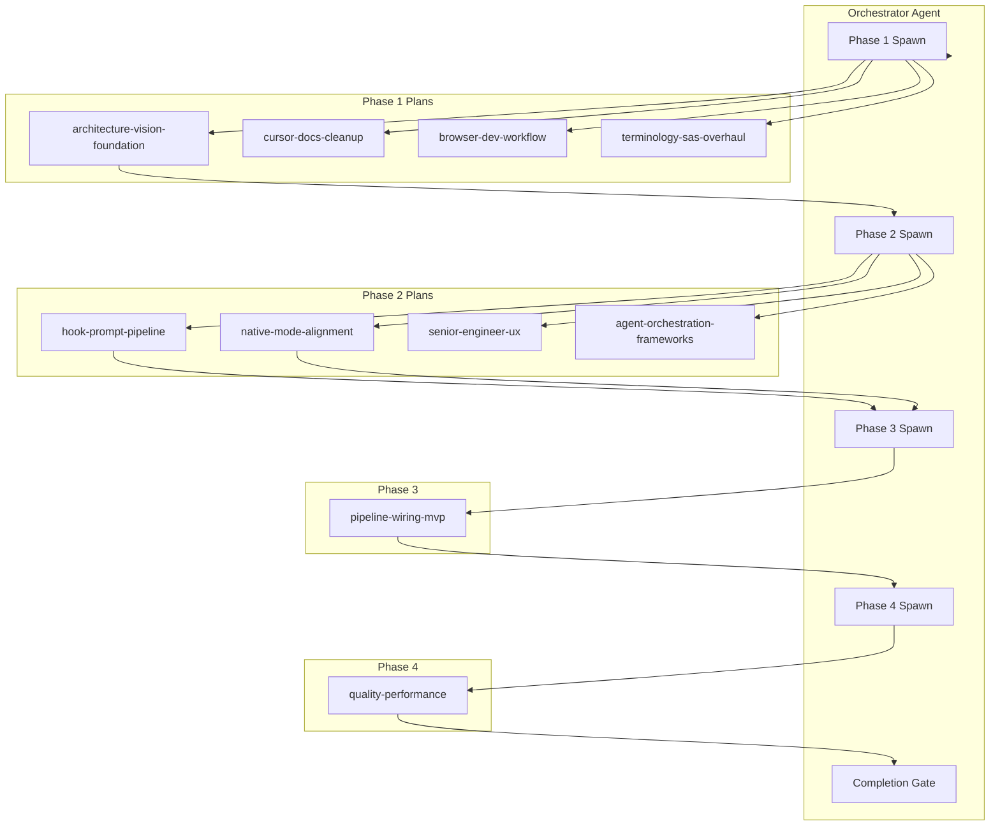
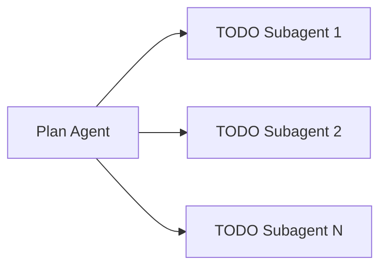

# Subagent Plan Execution Orchestration

## Context

- **10 active plans** across 4 phases (82 pending TODOs total)
- **Phase ordering**: 1 (foundation) → 2 (core refactor) → 3 (wiring) → 4 (quality)
- **Source**: [plan-master.diagram.md](.cursor/plans/plan-master.diagram.md), [plan-orchestration-spec.md](.cursor/plans/plan-orchestration-spec.md)
- **Tool**: `mcp_task` with `subagent_type: generalPurpose` for plan/TODO execution; `explore` for read-only; `shell` for commands

---

## Architecture

**Plan agent → TODO subagent** (nested spawn):

---

## Agent Contracts

### Orchestrator Agent

- **Role**: Spawn plan-level subagents in phase order; enforce gates; run `/plan-sync` after each phase.
- **Todo tasks** (orchestrator's own checklist):
  1. Validate all Phase 1 dependencies (none) — spawn 4 plan agents in parallel
  2. Wait for Phase 1 completion; run `plan-sync`; verify Phase 2 unblocked
  3. Spawn 4 Phase 2 plan agents in parallel
  4. Wait for Phase 2 completion; run `plan-sync`; verify Phase 3 unblocked
  5. Spawn pipeline-wiring-mvp agent
  6. Wait for Phase 3 completion; run `plan-sync`; verify Phase 4 unblocked
  7. Spawn quality-performance agent
  8. On quality-performance complete: run completion gate (reconciliation + `npm test` + `npm run compile`)

### Plan Agent (one per plan)

- **Input**: Plan file path, `planId`, full TODO list from frontmatter
- **Todo tasks** (derived from plan TODOs): One todo per plan TODO; mark `in_progress` when starting, `completed` when done
- **Behavior**:
  - For each TODO: either execute directly OR spawn a TODO subagent via `mcp_task`
  - Spawn subagents for: (a) independent TODOs in parallel, (b) complex multi-file TODOs
  - Update `.plan.md` frontmatter after each TODO completion
  - When all TODOs done: add `## Reconciliation` section; return summary to orchestrator
- **Output**: Updated plan file; completion summary for orchestrator

### TODO Subagent (spawned by plan agent)

- **Input**: Single TODO (id, content, acceptance criteria); plan file path; relevant source files (from `attachments`)
- **Todo tasks**: Single-item checklist — complete the TODO
- **Behavior**: Implement; edit plan file to set `status: completed`; return evidence (files changed, tests run)
- **Output**: Completion confirmation; list of modified files

---

## Phase Mapping

| Phase | Plans | Deps | Parallelism |
|-------|-------|------|-------------|
| 1 | architecture-vision-foundation, cursor-docs-cleanup, browser-dev-workflow, terminology-sas-overhaul | architecture-vision-foundation blocks cursor-docs-cleanup | 4 agents (coordinate cdc + tso on docs) |
| 2 | hook-prompt-pipeline, native-mode-alignment, senior-engineer-ux, agent-orchestration-frameworks | All depend on architecture-vision-foundation | 4 agents |
| 3 | pipeline-wiring-mvp | hook-prompt-pipeline, native-mode-alignment | 1 agent |
| 4 | quality-performance | pipeline-wiring-mvp | 1 agent |

---

## Implementation Steps

### 1. Create orchestrator command/skill

- **File**: `.cursor/commands/execute-plans.md` (or extend existing [execute-plan.md](.cursor/commands/execute-plan.md))
- **Content**: Step-by-step instructions for the orchestrator agent: phase order, spawn pattern, gate checks, `plan-sync` invocations
- **Todo task format**: Orchestrator maintains a checklist in the command or in a transient `.cursor/plans/.orchestrator-state.json`

### 2. Define plan-agent prompt template

- **File**: `.cursor/prompts/plan-agent-prompt.md` or inline in command
- **Template variables**: `{{planId}}`, `{{planPath}}`, `{{todos}}`, `{{phase}}`
- **Instructions**: Read plan file; for each pending TODO, either execute or spawn `mcp_task` with `generalPurpose`; pass plan path as attachment; require todo-task discipline (mark in_progress → completed)

### 3. Define TODO subagent prompt template

- **Variables**: `{{todoId}}`, `{{content}}`, `{{planPath}}`, `{{attachments}}`
- **Instructions**: Single-focus implementation; update plan frontmatter; return evidence

### 4. Add orchestrator state file (optional)

- **File**: `.cursor/plans/.orchestrator-state.json`
- **Purpose**: Track current phase, which plans are in_progress, completion timestamps
- **Updated by**: Orchestrator after each spawn/complete

### 5. Wire completion gate

- Reuse existing [plan-runner.py](.cursor/hooks/plan-runner.py) `sync-all` and completion gate logic
- Orchestrator runs `python3 .cursor/hooks/plan-runner.py sync-all` after each phase
- Final gate: `## Reconciliation` present, `npm test`, `npm run compile`

---

## Coordination Rules

1. **cursor-docs-cleanup + terminology-sas-overhaul**: Both touch docs. Options: (a) run sequentially (cdc first, then tso), or (b) spawn both with shared context — "coordinate on docs/ changes; tso renames may affect cdc outputs". Recommend sequential for safety.

2. **avf-09 vs agent-orchestration-frameworks**: ADR-0014 is written in architecture-vision-foundation (avf-09); agent-orchestration-frameworks (aof-01) also writes it. Resolve: avf-09 creates the ADR; aof-01 references/extends it or is marked duplicate — check plan content before spawn.

3. **Blocker protocol**: If a plan agent reports blocked (dependency failed, external blocker), orchestrator records severity + two alternatives + continues unblocked plans (per [subagent-planning-discipline.mdc](.cursor/rules/subagent-planning-discipline.mdc)).

---

## Deliverables

| Item | Location |
|------|----------|
| Orchestrator command | `.cursor/commands/execute-plans.md` |
| Plan-agent prompt template | Inline in command or `.cursor/prompts/` |
| TODO subagent prompt template | Inline in plan-agent instructions |
| Orchestrator state schema | `.cursor/plans/.orchestrator-state.json` (optional) |

---

## Risks and Mitigations

- **Token cost**: 10 plan agents × N TODO subagents. Mitigate: batch independent TODOs; use `fast` model for simple tasks.
- **Race on plan file**: Multiple agents editing same `.plan.md`. Mitigate: one plan agent per plan; TODO subagents return diffs, plan agent applies them.
- **Stale diagram**: Run `/plan-sync` after each plan completion, not just phase completion.
