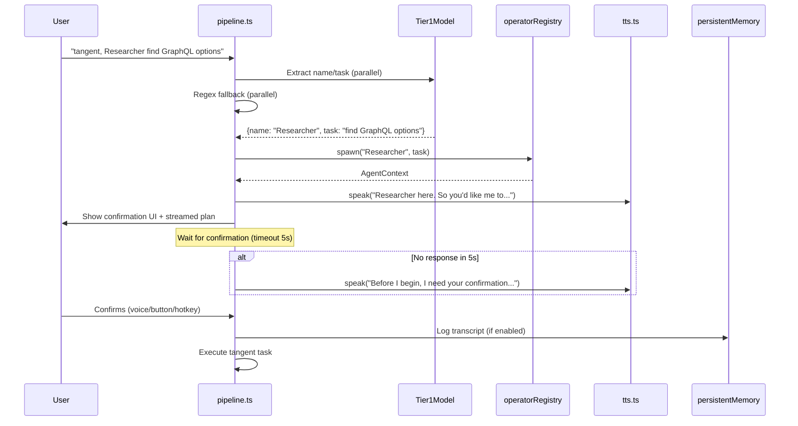

# Tangent Agent UX Features

## Current State

Existing infrastructure to build on:

- **Tangent detection**: `src/pipeline.ts:170-200` regex `^tangent\s+(.+)$` detects keyword and spawns via `operatorRegistry.spawn(undefined, task)` -- always passes `undefined` for name
- **Name pool config**: `package.json` defines `cursorDrive.operators.namePool` but `src/operatorRegistry.ts` uses hardcoded `DEFAULT_NAMES` -- config is never read
- **Approval gates**: `src/approvalGates.ts` has full warn/block modal system; `src/pipeline.ts:94-108` has `requestCheckpoint()` for sub-agent approval
- **TTS**: `src/tts.ts` has `speak()`, `stop()`, `interruptOnInput` flag -- but no tracking of what was spoken
- **Session memory**: `src/sessionMemory.ts` stores summaries in `workspaceState`, has compaction
- **Persistent memory**: `src/persistentMemory.ts` has file-based storage skeleton (`.drive/memory/`) with BM25 search -- **not wired** to extension
- **Privacy**: ADR-0005 prohibits transcript persistence by default; config `cursorDrive.privacy.transcriptPersistence` exists but is unused

Documentation references user-provided naming (e.g. "tangent call it Researcher -- explore GraphQL") in `docs/prd/prd-multi-agent.md:78` and `.cursor/skills/tangent/SKILL.md:32` but no implementation exists.

---

## Feature 1: Tangent Name Extraction

**Goal**: Parse "tangent, {agent name} {task}" via a parallel Tier-1 model call, falling back to regex heuristic.

**Changes**:

- **`src/pipeline.ts`** -- Replace the single tangent regex with a two-step flow:
  1. Regex captures the full text after "tangent"
  2. Fire a Tier-1 model call (via `src/modelSelector.ts` routing tier) in parallel to classify whether user provided a name. Prompt: given the text after "tangent", extract `{name, task}` or `{task}` only. Short structured output.
  3. If model returns a name, pass it to `operatorRegistry.spawn(name, task)`. If not, pass `undefined`.
  4. Guard: if extracted name matches the main agent name (foreground), ignore it and use default.

- **Fallback regex** (Tier-0, no model needed for simple patterns): `^tangent\s+(?:call it\s+)?(.+?)\s*[-—:]\s*(.+)$` catches "tangent call it Researcher -- task" and "tangent Jarvis -- task".

- **`src/operatorRegistry.ts`** -- Wire `cursorDrive.operators.namePool` config instead of hardcoded `DEFAULT_NAMES`. Read via `vscode.workspace.getConfiguration()` in `nextAvailableName()`.

**New setting** in `package.json`:
- Rename/keep `cursorDrive.operators.namePool` as an ordered JSON array (priority order is index order). Add description noting case-insensitive matching and multi-word support.

---

## Feature 2: Agent Introduction and Confirmation Flow

**Goal**: When a tangent agent spawns, it introduces itself, summarizes tasks, and waits for confirmation before executing.

**Changes**:

- **New function `confirmTangentAgent()` in `src/pipeline.ts`** (or extracted to a new `src/tangentFlow.ts` module):
  1. Agent speaks: `"{name} here. So you'd like me to {task summary}?"` via `tts.speak()`.
  2. Simultaneously stream a plan/todo list into the chat response (leverage existing `cursorCliRunner` streaming or inject into prompt response).
  3. Start a configurable timeout (e.g. 5s). If no user response, agent speaks: `"Before I begin, I need your confirmation. What are you thinking?"`.
  4. Wait for user input or confirmation button press.

- **Confirmation UI**:
  - Show a `vscode.window.showInformationMessage` with "Confirm" / "Edit Tasks" / "Cancel" buttons (reuse pattern from `requestCheckpoint()`).
  - Register a keybinding (e.g. `Ctrl+Shift+Y`) mapped to a new command `cursorDrive.confirmTangent` in `package.json` contributes.

- **New settings** in `package.json`:
  - `cursorDrive.agents.tangentConfirmationTimeout` (number, default: 5000ms)
  - `cursorDrive.agents.autoConfirmTangent` (boolean, default: false) -- skip confirmation
  - `cursorDrive.agents.delegateConfirmation` (boolean, default: false) -- let another agent assume user's answer

---

## Feature 3: Intelligent Clarification Handling

**Goal**: User speech pauses agent TTS; a model determines if the agent's response is still valid; agent can edit chat to reflect clarification.

**Changes**:

- **`src/tts.ts`** -- Add a `SpokenContentTracker`:
  - Record each `speak()` call's text in a circular buffer (last N utterances).
  - Expose `getSpokenHistory(): string[]` so the agent knows what it has said.
  - On `stop()`, record the interruption point (how far through the utterance).

- **`src/pipeline.ts`** (or new `src/clarificationHandler.ts`):
  - When user input arrives while TTS is active:
    1. Call `tts.stop()` (already exists).
    2. Fire a Tier-1 model call: "Given the agent was about to say X, and the user said Y, should the agent: (a) continue as planned, (b) modify response, (c) abandon and re-plan?" Short structured output.
    3. Based on result, either resume, regenerate, or start fresh.

- **Chat history refactoring**:
  - This depends on Cursor's chat API capabilities. If `beforeSubmitPrompt` hook can modify the returned prompt content, we can consolidate clarification into a single refined prompt rather than appending multiple turns.
  - In `src/sessionMemory.ts`, add an `updateTurn(index, newContent)` method alongside `addTurn()` so clarification replaces rather than appends.
  - `compact()` already summarizes old entries -- extend to merge clarification pairs into single entries.

**Constraint**: Editing actual Cursor chat UI messages is likely not possible via extension API. The "refactoring" will happen at the session memory / context injection layer, not the visible chat.

---

## Feature 4: Transcript History with Wake Word

**Goal**: Store transcripts locally when drive mode + wake word is active; configurable retention; queryable.

**Changes**:

- **Wire `src/persistentMemory.ts`**:
  - It already has file-based daily logs and BM25 search -- just needs activation.
  - In `src/extension.ts`, call `persistentMemory.initialize()` and expose it to pipeline.
  - Gate transcript logging behind `cursorDrive.privacy.transcriptPersistence` (already defined, just unused).

- **Add transcript-specific logging in `src/pipeline.ts`**:
  - When wake word mode is active and `transcriptPersistence` is `true`, append raw user input to daily log via `persistentMemory.appendToday()`.
  - Include timestamp and whether it was voice or text input.

- **New settings** in `package.json`:
  - `cursorDrive.privacy.transcriptRetentionDays` (number, default: 30) -- auto-delete logs older than N days
  - Reuse existing `cursorDrive.privacy.transcriptPersistence` (default: `false`, respecting ADR-0005)

- **Retention cleanup**: Add a `persistentMemory.pruneOlderThan(days)` method called on extension activation.

- **Expose query via MCP**: Add an `operator_search_history` tool in `src/mcpServer.ts` that calls `persistentMemory.search(query)`. This lets the user ask the agent about previous requests.

---

## Architecture Flow

