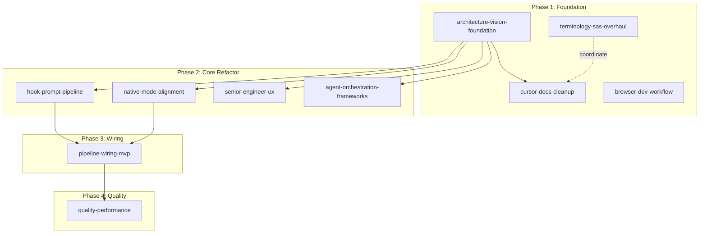

# Terminology, S-AS, and Config Overhaul

## Key decision: "operator" vs "engineer"

The codebase has a **semantic collision**: Cursor's native `Agent` mode (`SubMode = "agent"`) overlaps with Drive's multi-worker concept (`AgentRegistry`, `agent_spawn`, etc.). These must be disambiguated.

| Term | Hierarchy | Config key | Conflict risk |
|---|---|---|---|
| **operator** | Drive -> Operators -> Agents (subagents) | `cursorDrive.operators.maxConcurrent` | None; clean separation |
| **engineer** | Drive -> Engineers -> Agents (subagents) | `cursorDrive.engineers.maxConcurrent` | Confusion with human engineers |

**Recommendation: "operator"** -- carries elite autonomous connotation (special forces, DevOps), is short, config-friendly, and creates unambiguous hierarchy. Drive is the handler/director; operators are the senior workers it dispatches; agents are Cursor's built-in subagents that operators can spawn.

If the user prefers "engineer," the plan works identically -- just swap the word.

## What changes

### Phase 1: Naming ADR + config schema (foundation)

**1a. Write ADR-0016: Drive Terminology and Hierarchy**

Define: Drive (handler) -> Operators (spawned workers) -> Agents (Cursor subagents). Document:
- Why "agent" is ambiguous (Cursor's Agent mode vs Drive's workers)
- Why "operator" (or chosen term) resolves it
- Migration path for MCP tool names (deprecation aliases)
- ShareScreen -> S-AS naming rationale

**1b. Update `package.json` config schema**

Rename and add granular settings:

| Old key | New key | Change |
|---|---|---|
| `cursorDrive.agents.maxConcurrent` | `cursorDrive.operators.maxConcurrent` | Rename; default: 3 |
| _(new)_ | `cursorDrive.operators.maxSubAgentsPerOperator` | Max Task-tool subagents each operator can spawn; default: 4 |
| _(new)_ | `cursorDrive.operators.defaultPermissionPreset` | Permission preset for new operators; default: "standard" |
| _(new)_ | `cursorDrive.operators.namePool` | Array of default operator names; default: Greek letters |
| `cursorDrive.shareScreen.enabled` | `cursorDrive.agentScreen.enabled` | Rename |
| `cursorDrive.shareScreen.autoOpen` | `cursorDrive.agentScreen.autoOpen` | Rename |
| _(new)_ | `cursorDrive.agentScreen.displayMode` | "tab" / "panel" / "bottomLog"; default: "tab" |
| _(new)_ | `cursorDrive.agentScreen.clickBehavior` | "openInEditor" / "openInNewWindow"; default: "openInEditor" |
| _(new)_ | `cursorDrive.agentScreen.showPlanProgress` | Show active plan TODOs overlay; default: true |

**1c. Update command IDs and palette entries**

| Old | New |
|---|---|
| `cursorDrive.agents` / "Manage Agents" | `cursorDrive.operators` / "Manage Operators" |
| `cursorDrive.spawnAgent` / "Spawn New Agent" | `cursorDrive.spawnOperator` / "Spawn New Operator" |
| `cursorDrive.showShareScreen` / "Show Share Screen" | `cursorDrive.showAgentScreen` / "Show Agent Screen" |
| `cursorDrive.clearShareScreen` / "Clear Share Screen" | `cursorDrive.clearAgentScreen` / "Clear Agent Screen" |

### Phase 2: Source code rename (mechanical)

Rename across `src/` files. This is a large but mechanical change:

| File | Renames |
|---|---|
| `src/agentRegistry.ts` -> `src/operatorRegistry.ts` | `AgentRegistry` -> `OperatorRegistry`, `AgentContext` -> `OperatorContext`, `AgentStatus` -> `OperatorStatus` |
| `src/shareScreen.ts` -> `src/agentScreen.ts` | `ShareScreenPanel` -> `AgentScreenPanel`, viewType, title, all "Share Screen" strings |
| `src/mcpServer.ts` | Tool names: `agent_spawn` -> `operator_spawn`, etc. (keep old names as deprecated aliases for backward compat) |
| `src/extension.ts` | Import paths, variable names, command registrations, all UI strings |
| `src/statusBar.ts` | "No Agent" -> "No Operator", tooltip text |
| `src/toolAllowlist.ts` | `agentName` parameters -> `operatorName` |
| `src/sessionMemory.ts` | `agent` field -> `operator` |
| `src/glossaryExpander.ts` | "spawn a parallel agent" -> "spawn a parallel operator" |

**Critical exception**: `SubMode = "agent"` in `src/driveMode.ts` stays as-is -- this refers to Cursor's native Agent mode, not Drive's operators.

### Phase 3: S-AS (Share-AgentScreen) feature enhancement

The renamed `AgentScreenPanel` gets new interactive capabilities:

**3a. Enhanced click-to-open**
- Activity items: clicking a file path in the activity feed opens it in editor (currently only file-tab items are clickable)
- Config-driven: `agentScreen.clickBehavior` controls "openInEditor" vs "openInNewWindow"

**3b. Ctrl+click highlight-and-ask**
- Ctrl+clicking an element in S-AS highlights it with a border/glow
- A small floating input appears: "Ask about this..." (similar to Ctrl+K inline chat)
- Submitting the question routes it through Drive's pipeline as a contextual question about the highlighted item

**3c. Plan progress overlay**
- When `agentScreen.showPlanProgress` is enabled, the panel shows a collapsible section at the top:
  - Active plan name + progress bar (X/Y TODOs)
  - Currently in_progress TODO highlighted
  - Clicking a TODO opens the plan file at that line

**3d. Display mode flexibility**
- `"tab"`: current behavior (webview panel beside editor)
- `"panel"`: appears in the bottom panel area (like Problems/Terminal)
- `"bottomLog"`: minimal log-only view, no tabs, appended at bottom of Agents panel if it exists

**3e. Rename the webview content**
- Title: "Agent Screen" (not "Share Screen")
- Header shows operator name badge: "Alpha's Workspace" not "Alpha -- Share Screen"
- Empty state: "Waiting for operator activity..." not "Waiting for agent activity..."

### Phase 4: MCP tool migration (backward compatible)

| New tool name | Old name (deprecated alias) |
|---|---|
| `operator_spawn` | `agent_spawn` |
| `operator_switch` | `agent_switch` |
| `operator_list` | `agent_list` |
| `operator_pause` | `agent_pause` |
| `operator_resume` | `agent_resume` |
| `operator_dismiss` | `agent_dismiss` |
| `operator_merge` | `agent_merge` |
| `agent_screen_activity` | `share_screen_activity` |
| `agent_screen_file` | `share_screen_file` |
| `agent_screen_decision` | `share_screen_decision` |

Old names route to new implementations. Log a deprecation warning on first use.

### Phase 5: Docs and plans alignment

Update all documentation to use new terminology:
- PRDs (5 files, ~340 "agent" references that refer to Drive's workers)
- Design docs
- Architecture docs and ADRs
- Reference docs (config-schema, mcp-tools, commands)
- `.cursor/` skills, commands, rules
- Existing plan files
- README, CHANGELOG, CONTRIBUTING

**Key nuance**: Keep "agent" where it refers to Cursor's native Agent mode or to generic AI agent concepts. Only rename where it refers to Drive's spawned worker concept.

## New plan file: `terminology-sas-overhaul.plan.md`

- **planId**: `terminology-sas-overhaul`
- **parentPlanId**: `cursor-drive`
- **dependsOn**: `[]` (can start immediately; touches config/naming, not pipeline logic)

This plan has ~12 TODOs across the 5 phases. It does not depend on architecture-vision-foundation because it's a naming/UX change, not an architectural one. However, it should coordinate with `cursor-docs-cleanup` (which also touches docs) to avoid merge conflicts.

## Updated dependency DAG

## Files to create/modify

| File | Action |
|---|---|
| `.cursor/plans/terminology-sas-overhaul.plan.md` | CREATE |
| `.cursor/plans/cursor-drive.plan.md` | ADD childPlanId + workstream TODO |
| `.cursor/plans/plan-graph.yaml` | ADD plan node |
| `.cursor/plans/registry.yaml` | ADD plan entry |
| `.cursor/plans/plan-master.diagram.md` | REGENERATE |
