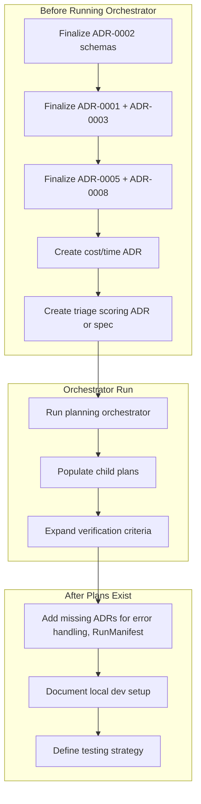

# TLDR Research Ops — Fresh Project Gap Analysis

## Summary of Subagent Findings

Three subagents reviewed [.cursor/plans/tldr-research-ops.plan.md](.cursor/plans/tldr-research-ops.plan.md), [docs/adr](docs/adr), [docs/guides](docs/guides), and [docs/prd](docs/prd). Key findings:

- **ADRs:** All 8 are Status: Proposed with TBD decisions; 2 circular dependency pairs (1↔3, 5↔8); 3 missing cross-references; 5 potential missing ADRs
- **PRD:** Comprehensive scope; Section 10 open questions unresolved; no ADR for triage scoring, depth policy, or cost/time controls
- **Plan structure:** `plan-graph.yaml` and `registry.yaml` exist but empty (no child plans); phase gates underspecified; verification does not check invariant encoding or ADR reflection

---

## 1. Decision Sequencing (Blockers)

Before running the orchestrator or starting implementation:

| Order | ADR Pair            | Rationale                                                                                                |
| ----- | ------------------- | -------------------------------------------------------------------------------------------------------- |
| 1     | ADR-0002 (schemas)  | Blocks all artifact-producing stages; schema choice affects storage (ADR-0005) and evaluation (ADR-0008) |
| 2     | ADR-0001 + ADR-0003 | Scheduling determines secrets store; decide together to break circular dep                               |
| 3     | ADR-0005 + ADR-0008 | Storage layout enables replay; decide storage first                                                      |
| 4     | ADR-0006 + ADR-0007 | Safety gates need RepoRegistry context; add ADR-0006 → ADR-0007 cross-ref                                |

**Action:** Add a "Decision sequencing" section to the root plan or a bootstrap meta-plan that enforces this order before Phase 2 synthesis.

---

## 2. Missing ADRs (Gaps)

| Gap                            | Rationale                                                                                   |
| ------------------------------ | ------------------------------------------------------------------------------------------- |
| **Cost/time controls**         | Invariant states "top-N cap, depth policy, fetch caps, retries, stop conditions" but no ADR |
| **Triage scoring algorithm**   | FR3 defines 6 dimensions; no formula, weights, or depth thresholds                          |
| **Depth policy configuration** | FR5 mentions skim/medium/deep; no thresholds or time-budget mapping                         |
| **Error handling & retry**     | NFR4 requires retry policy; no backoff, idempotency, or failure-mode spec                   |
| **RunManifest schema**         | Referenced in ADR-0002, ADR-0005, ADR-0008; no dedicated schema spec                        |

**Action:** Create ADRs for cost/time controls and triage scoring before P1; fold depth policy into triage ADR or FR5 spec.

---

## 3. Plan Structure Gaps

### Phase gates

- No explicit success criteria for Phase 1 completion (e.g., all 8 subagents succeeded)
- Phase 3 → Phase 4 gate not specified
- No rollback/remediation path if a phase gate fails

### Verification expansion

Current verification (orchestrator Phase 5) does not check:

- Invariant encoding in child plans
- ADR decisions reflected in plans
- PRD requirements mapped to TODOs
- Artifact schema completeness vs PRD §5

### TODO schema

- No template for TODO structure (acceptance criteria format, dependency links)
- No TODO-to-invariant or TODO-to-ADR traceability fields

**Action:** Extend [docs/guides/orchestrator-prompt.md](docs/guides/orchestrator-prompt.md) Phase 5 verification list; add TODO schema to root plan or a CONTRIBUTING-style doc.

---

## 4. Software Engineering Wisdom for Fresh Projects

Areas often overlooked when starting from scratch:

### 4.1 Local development & onboarding

- **Local dev setup:** One-command bootstrap (e.g., `make dev` or `./scripts/setup.sh`); documented in README
- **Environment parity:** Dev vs prod config (secrets, rate limits, caps) — avoid "works on my machine"
- **Docs:** [docs/git-credentials-windows-setup.md](docs/git-credentials-windows-setup.md) exists; consider `docs/setup.md` or `docs/development.md` for full local run

### 4.2 Testing strategy

- **Not in PRD/ADRs:** Unit vs integration vs e2e; replay/regression (ADR-0008 mentions but no spec)
- **Artifact replay:** Stored runs for deterministic regression; needs schema + storage decision first
- **Mock boundaries:** What to mock (OpenAI, Gmail, GitHub) vs contract tests

### 4.3 Observability

- **Logging:** Structured logs (JSON) for parsing; log levels and what goes where
- **Metrics:** M1–M5 success metrics — how collected, stored, surfaced
- **Tracing:** Pipeline stage timing (RunManifest covers partially); distributed trace IDs if multi-process
- **Alerting:** No runbook for failed runs, rate limits, cost spikes

### 4.4 CI/CD

- **Not specified:** Lint/test on PR; schema validation in CI; artifact validation gates
- **Secrets:** CI vs local secrets handling (ADR-0003 defers)
- **Deployment:** P5 mentions GitHub Actions; no rollback or canary strategy

### 4.5 Security & compliance

- **Secrets rotation:** ADR-0003 says "rotation-ready" but no rotation procedure
- **Dependency scanning:** Dependabot/Renovate; supply chain
- **Audit trail:** RunManifest exists; retention, access, and export not specified

### 4.6 Data & schema evolution

- **Schema versioning:** ADR-0002 defers; backward compatibility and migration path
- **Artifact retention:** ADR-0005 defers; cleanup policy, archival
- **Idempotency:** Re-runs on same input; dedupe (FR1) vs full idempotency

### 4.7 Git & collaboration

- **Branch strategy:** ADR-0006 mentions but not defined
- **PR template:** Checklist for ADR alignment, invariant checks
- **Commit conventions:** Optional; helps changelog and traceability

### 4.8 Failure modes & resilience

- **Rate limits:** OpenAI, Gmail, GitHub — backoff, queue, or fail-fast
- **Partial failures:** Stage N fails; resume vs full rerun; checkpointing
- **Cost runaway:** Hard caps vs soft warnings; kill switch

---

## 5. Recommended Action Order

---

## 6. Open Questions to Resolve

From PRD Section 10 (still open):

- Which TL;DR variants in scope initially?
- Gmail API vs forwarding vs manual paste for early stages?
- Where do artifacts live long-term?
- Preferred review UX?

**Recommendation:** Resolve or explicitly defer each to a child plan TODO before P1 kickoff.

---

## 7. Files to Create or Update

| File                                      | Action                                                      |
| ----------------------------------------- | ----------------------------------------------------------- |
| `.cursor/plans/tldr-research-ops.plan.md` | Add decision sequencing section; expand phase gate criteria |
| `docs/guides/orchestrator-prompt.md`      | Expand Phase 5 verification; add invariant/ADR/PRD checks   |
| `docs/adr/ADR-0009-cost-time-controls.md` | New ADR (proposed)                                          |
| `docs/adr/ADR-0010-triage-scoring.md`     | New ADR or extend FR3 spec (proposed)                       |
| `docs/setup.md` or `README.md`            | Local dev setup, one-command bootstrap                      |
| Bootstrap meta-plan                       | Optional; sequences ADR finalization before orchestrator    |

---

## 8. Invariant Traceability (Current Gap)

Root plan TODO #3: "Validate non-negotiable invariants are encoded in at least one child plan's acceptance criteria each."

**Cost/time controls** invariant has no ADR and no child plan yet. Add ADR-0009 and ensure it is linked from the root plan's invariant list.