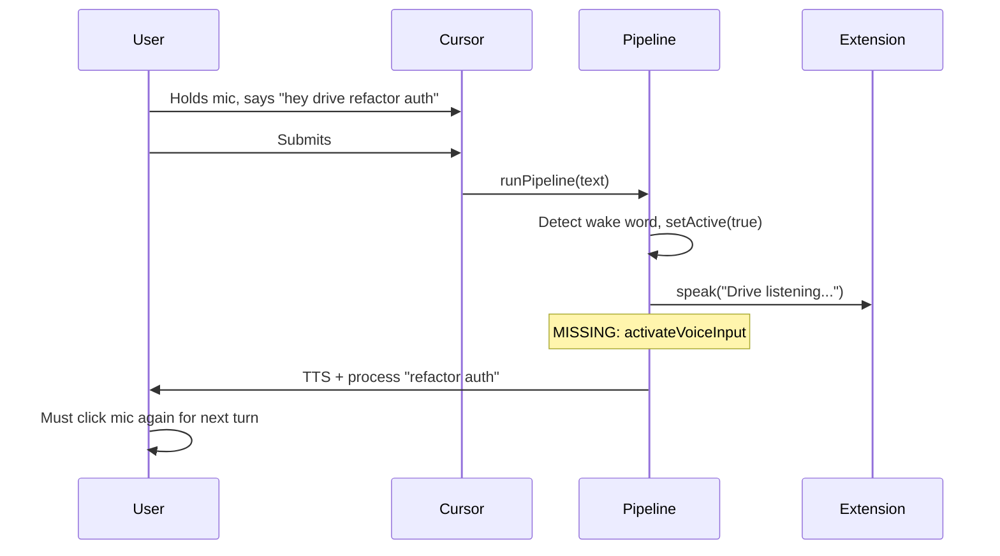

# Wake word triggers mic activation

## Summary from research

Subagent exploration of [docs/prd/](docs/prd/), [docs/architecture/adr/](docs/architecture/adr/), and the pipeline flow shows:

- **PRD / design docs:** Wake word → agent says "Drive listening" → mic on for next utterance. Target: hands-free flow.
- **ADR-0012:** Mic is mute/unmute; wake word is optional; primary activation is Drive toggle. Wake word can activate Drive when configured.
- **Current gap:** Wake word is detected in [src/pipeline.ts](src/pipeline.ts) (lines 150–179) on submitted text. When detected, we activate Drive, speak TTS, and show status bar — but we do **not** turn the mic on. The user must click the mic again for the next turn.

## Constraint: wake word is post-submission

Wake word is detected only after the user submits (Cursor STT → submit → `beforeSubmitPrompt` → pipeline). There is no live-audio wake-word path; extensions cannot intercept Cursor's STT. So "immediately when wake word is said" means: **as soon as we detect it in the pipeline**, we trigger mic activation for the **next** utterance.




## Fix

In [src/pipeline.ts](src/pipeline.ts), when `activatedByWakeWord` is true, call `cursorDrive.activateVoiceInput` so the mic is on for the next turn.

**Location:** After the TTS and status bar (lines 165–166), before the `if (!text)` early-return block.

**Code change:**

```typescript
    speak("Drive listening. How can I help?");
    void vscode.window.setStatusBarMessage("$(mic) Drive listening", 5000);

    // Turn mic on for next utterance — hands-free follow-up without clicking mic again
    void vscode.commands.executeCommand("cursorDrive.activateVoiceInput");

    if (!text) {
```

**Why this is safe:**

- We only enter this block when `!ctx.driveActive && wakeWordMatch` — i.e. Drive was off and we just activated it. The mic was off (user had to click to speak). Turning it on is correct.
- When Drive is already active, we never enter this block, so we do not toggle the mic when it might already be on.
- `activateVoiceInput` opens chat, focuses composer, waits `activateMicDelayMs`, then runs the mic command chain. Idempotent for "chat already open."

## Edge cases


| Case                                           | Behavior                                                        |
| ---------------------------------------------- | --------------------------------------------------------------- |
| Wake word only ("hey drive")                   | Early return with tangentAck; mic turned on for next prompt     |
| Wake word + prompt ("hey drive refactor auth") | Process prompt; mic turned on for next prompt                   |
| Drive already on, user says "hey drive" again  | Block not entered (condition `!ctx.driveActive`); no mic change |
| `composer.toggleVoiceDictation` toggles        | N/A — we only call when mic was off (Drive was off)             |


## Files to change

- [src/pipeline.ts](src/pipeline.ts): Add `void vscode.commands.executeCommand("cursorDrive.activateVoiceInput")` after the status bar message, inside the wake-word block.

## Docs

- [docs/reference/cursor-native-commands.md](docs/reference/cursor-native-commands.md): Note that wake-word detection triggers mic activation for the next turn.
- Optional: One-line note in [docs/prd/prd-voice-io.md](docs/prd/prd-voice-io.md) or voice flow docs that wake word → mic on for follow-up.
