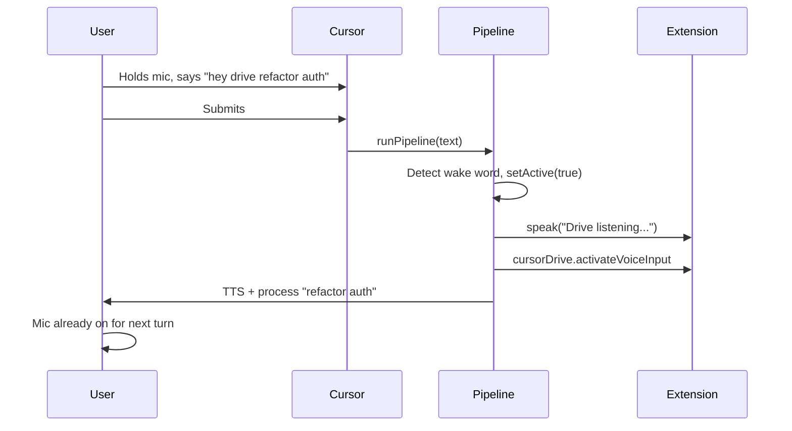

# Wake word triggers mic activation

## Current state

The implementation is **already present** in the codebase:

- [src/pipeline.ts](src/pipeline.ts) lines 167–169: `void vscode.commands.executeCommand("cursorDrive.activateVoiceInput")` is called inside the wake-word block after TTS and status bar.
- [docs/reference/cursor-native-commands.md](docs/reference/cursor-native-commands.md) line 64: Documents that wake word triggers mic for the next utterance.

## Constraint

Wake word is detected only **after** the user submits (Cursor STT → submit → `beforeSubmitPrompt` → pipeline). There is no live-audio wake-word path. So "immediately when wake word is said" means: as soon as we detect it in the pipeline, we trigger mic activation for the **next** utterance.

## Flow




## Edge cases


| Case                                           | Behavior                                                    |
| ---------------------------------------------- | ----------------------------------------------------------- |
| Wake word only ("hey drive")                   | Early return with tangentAck; mic turned on for next prompt |
| Wake word + prompt ("hey drive refactor auth") | Process prompt; mic turned on for next prompt               |
| Drive already on, user says "hey drive" again  | Block not entered (`!ctx.driveActive`); no mic change       |
| `composer.toggleVoiceDictation` toggles        | N/A — we only call when mic was off (Drive was off)         |


## If implementing from scratch

1. **Code change** in [src/pipeline.ts](src/pipeline.ts): Inside the wake-word block (after `speak` and `setStatusBarMessage`, before the `if (!text)` early return), add:

```typescript
   void vscode.commands.executeCommand("cursorDrive.activateVoiceInput");


```

1. **Docs** in [docs/reference/cursor-native-commands.md](docs/reference/cursor-native-commands.md): Add a note that wake-word detection triggers mic activation for the next turn.

## Verification (when you run it)

1. Turn Drive off. Hold mic, say "hey drive refactor foo", submit.
2. Confirm TTS plays "Drive listening. How can I help?" and mic stays on for the next utterance.
3. Say a follow-up without clicking mic; it should be captured.
4. With Drive already on, say "hey drive" again — mic should not toggle unexpectedly.
