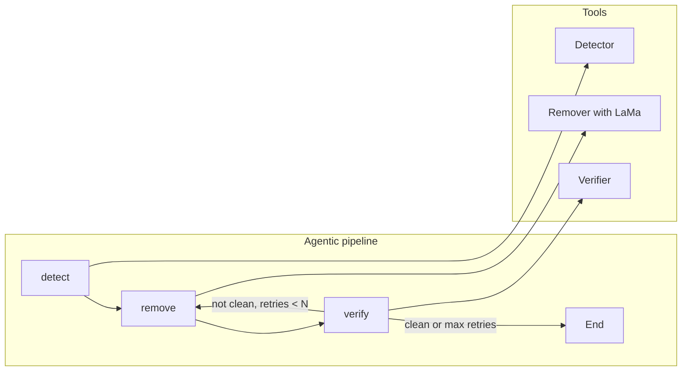

# Watermark Removal Fix and Agentic Pipeline Plan

## Part 1: Why the result is blurred and what “removed” should look like

**What went wrong**
The current pipeline uses **OpenCV inpainting** ([`visible_watermark_remover.py`](src/cleaning/visible_watermark_remover.py) `_apply_inpainting`): `cv2.inpaint(..., cv2.INPAINT_TELEA)` (and optionally NS). These algorithms propagate from the boundary inward and fill the mask with smooth, diffused values. They do **not** model texture or structure, so the filled region looks like a smooth blur rather than continuing the desk’s wood grain and carvings.

**Intended outcome (critical thinking)**
If the watermark were correctly removed, the **bottom-right** area (where the star-like emblem was) should look like the **rest of the ornate desk**: same dark wood, grain, and carved detail, with no visible patch, blur, or seam. The boundary between “was watermark” and “desk” should be invisible. Right now we get a homogeneous blur instead of that continuation.

(If you also meant the **lower-left** (e.g. mug area) is blurred, the same fix applies: any region we inpaint should use a method that can reconstruct local texture, not just smooth it.)

---

## Part 2: Fix blurred removal — learning-based inpainting

**Approach**
Use **learning-based inpainting** for the watermark region so the fill is texture- and structure-aware instead of PDE-smoothed.

**Recommended backend: LaMa**
- **Repo:** [advimman/lama](https://github.com/advimman/lama) (WACV 2022).
- **Why:** Handles large masks, resolution-robust (works above training res), good for structured/textured content; pre-trained models available; [simple-lama-inpainting](https://github.com/advimman/lama/issues/227) exists for easier Python use.
- **Alternative:** MAT (Mask-Aware Transformer, [dvlab-research/MAT](https://github.com/dvlab-research/MAT)) for large holes; more heavy-weight.

**Implementation steps**

1. **Add LaMa (or wrapper) as optional dependency**
   - e.g. `simple-lama-inpainting` or clone `advimman/lama` and add a small helper that: loads image + binary mask (same size as image), runs LaMa, returns RGB image.
   - Keep it optional so the project still runs without PyTorch/LaMa.

2. **Extend [`src/cleaning/visible_watermark_remover.py`](src/cleaning/visible_watermark_remover.py)**
   - Add a path that, when `method="lama"` (or a new `method="lama_inpaint"`), builds a mask from `detection_results` (same logic as current inpainting: per-detection `location` → mask, optionally expanded).
   - Call LaMa with the image and mask; replace current `_apply_inpainting` for that method or add `_apply_lama_inpainting`.
   - If LaMa is not available, fall back to existing `cv2.inpaint` and log a warning.

3. **Wire through [`scripts/remove_region.py`](scripts/remove_region.py)**
   - Add `--method lama` (in addition to `inpainting`, `gradient_guided`, `multi_scale_blending`).
   - When `lama` is chosen, pass it through to `remove_visible_watermarks(..., method="lama")` so the bottom-right (or any manual region) is filled with LaMa instead of OpenCV.

4. **Optional: try OpenCV NS**
   - In the existing remover, try `cv2.INPAINT_NS` as well (or a `--method opencv_ns`). It can sometimes look slightly different but will still be smooth; the main fix is LaMa.

**Result**
- `office_crocs_cleaned.png` → run `remove_region.py` with `--method lama` → output should show desk texture continuing into the former watermark area instead of a blur.
- No change to detection; only the fill algorithm for the masked region changes.

---

## Part 3: Agentic pipeline (detect → remove → verify, self-learning)

**Goal**
A pipeline that: (1) detects watermarks, (2) removes them with tools (e.g. our remover with LaMa), (3) verifies that the image is “clean” (no or minimal remaining watermark), (4) optionally retries with different params or masks, and (5) can log outcomes for later tuning or learning.

**Research summary (from discovery)**
- **Mirofish:** The public “MiroFish” repo found is unrelated (e.g. swarm/prediction). Not a fit for this use case.
- **AutoGluon:** Strong for vision models (e.g. training a “watermark present?” classifier) but does not provide an agent loop or tool use; use as a component (e.g. verifier model), not the orchestrator.
- **Frameworks that fit:**
  - **LangGraph:** Explicit state graph, `ToolNode`, conditional edges, cycles. Pattern: detect → remove → verify → if not clean and retries &lt; N → remove again (e.g. different mask/params) or re-detect, else end. Good for strict control flow and human-in-the-loop.
  - **AutoGen:** Multi-agent (e.g. Assistant + UserProxy); tools for detect/remove/verify; feedback via messages; good if you want LLM-driven “reasoning” about retries.
  - **Custom loop:** Minimal: `while not verified and retries < N: mask = detector(image); cleaned = remover(image, mask); ok, score = verifier(cleaned); ...`. Easiest to plug in existing Python (e.g. our detector + LaMa remover + a verifier).

**Suggested architecture (high level)**

**Concrete options**

| Option | Description |
|--------|-------------|
| **A. LangGraph** | Nodes: `detect` (tool: run detector → mask/bboxes), `remove` (tool: run remover with mask, e.g. LaMa), `verify` (tool: run verifier → score or “clean” flag). State: image path, mask, cleaned path, verification result, retry count. Conditional edge from `verify`: if not clean and retries &lt; N → `remove` (e.g. dilated mask or different method) or `detect`, else → end. |
| **B. Custom loop** | Single script or small module: loop as above; tools = current detector, remover (with LaMa), and a verifier (e.g. run same detector on cleaned image and require no high-confidence hits, or use a small classifier). Easiest to implement with existing code; add logging (image, mask, result path, score) for later threshold tuning or training. |
| **C. AutoGen** | Assistant agent with tools `run_detector`, `run_remover`, `run_verifier`; UserProxy executes them; conversation loop until “clean” or max turns. Good if you want the model to decide retry strategy in natural language. |

**Verifier**
- Re-run existing visible (and optionally LSB/advanced) detector on the **cleaned** image; require zero (or below-threshold) detections.
- Optional: train or use a small “watermark present / artifact” classifier (e.g. AutoGluon or a lightweight CNN) on crops; use its score as feedback.

**Self-learning**
- **V1:** No learning in the loop. Log (input path, mask, removal method, output path, verifier score, retries). Use logs to tune thresholds (e.g. “clean” threshold, mask dilation).
- **Later:** Use logs to fine-tune detector or remover, or to learn a “when to retry” policy (e.g. retry if score in range X–Y).

**Deliverables for Part 3**
- Design doc or ADR that chooses one of A/B/C and defines tool interfaces (inputs/outputs for detect, remove, verify).
- Implementation: either a LangGraph graph, an AutoGen agent group, or a `scripts/agentic_clean.py` (or similar) custom loop that calls existing detector, remover (with LaMa), and a verifier.
- Optional: small verifier module (re-use detector or call external model) and a logging format for outcomes.

---

## Part 4: Order of work

1. **Part 2 first:** Integrate LaMa (or MAT) into the remover and `remove_region.py` so the current “blurred” watermark area is fixed with plausible texture inpainting.
2. **Part 3 next:** Implement the agentic pipeline (LangGraph or custom loop recommended) with existing detector, updated remover, and a verifier; add logging.
3. **Self-learning:** Start with log-based threshold tuning; add training or policy learning later if needed.

---

## Summary

| Issue | Root cause | Fix |
|-------|------------|-----|
| Blurred lower-right (or any inpainted region) | OpenCV TELEA/NS produce smooth diffusion, not texture | Use LaMa (or MAT) for learning-based inpainting in remover and `remove_region.py` |
| “How should it look?” | Watermark area should look like untouched desk | Same wood grain and structure as surroundings; no visible patch or blur |
| Agentic pipeline | Need detect → remove → verify with retries | LangGraph (recommended) or custom loop; tools = detector, remover (with LaMa), verifier |
| Self-learning | Optional improvement over time | Log (image, mask, result, score); use for thresholds and, later, fine-tuning or retry policy |
