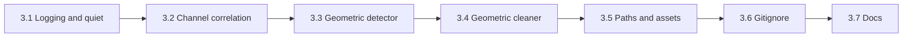

# Watermark Toolkit: Report Explanation, Effectiveness Analysis, and Improvements

## 1. Report findings (explanation)

**cursor_drive_report.json (before/after):**

- **Before cleaning:** All 5 files show only `geometric_watermarks` (confidence 0.60). The `patterns` object contains an **error** on every file: `'charmap' codec can't encode character '\U0001f50d'` (the magnifying-glass emoji in [steganography_sanitizer.py](src/cleaning/steganography_sanitizer.py) line 29). So **pattern detection (LSB bias, sequential encoding, channel correlation, white-pixel encoding) never succeeds on Windows** when stdout uses a non–UTF-8 console; findings from that run are incomplete.
- **After cleaning:** Same: only geometric_watermarks (0.60); patterns still error. So we cannot see from this report whether LSB/sequential/channel were actually removed.

**CURSOR_DRIVE_SUMMARY.md** (from an earlier run with pattern detection working):

- **Before:** logo-1/2 had geometric_watermarks + channel_correlation; logo-3/4/5 also had lsb_bias, sequential_encoding, white_pixel_encoding.
- **After (pre–geometric_transformation):** geometric_watermarks and channel_correlation remained; sequential_encoding remained on 3–5.
- **Full test (post–implementations):** Only geometric_watermarks remains; LSB/sequential/channel pattern findings cleared. Summary doc still says geometric_transformation was "Not implemented" (out of date).

**Takeaway:** The live report is skewed by the Windows emoji bug. The summary doc reflects the pipeline after adding geometric_transformation and compression_cycle; the only remaining flag is geometric_watermarks (likely natural SIFT keypoints or conservative threshold).

---

## 2. Effectiveness analysis (AI watermark expert view)

| Area                    | Current behavior                                                                                                                                                                                                                                      | Effectiveness issue                                                                                                                                    |
| ----------------------- | ----------------------------------------------------------------------------------------------------------------------------------------------------------------------------------------------------------------------------------------------------- | ------------------------------------------------------------------------------------------------------------------------------------------------------ |
| **Windows / logging**   | `print()` with emoji in sanitizer and image_cleaner                                                                                                                                                                                                   | Pattern detection fails on Windows (charmap); pipeline loses LSB/sequential/channel signals when run in default console.                               |
| **Geometric detector**  | [advanced_waste_detector.py](src/advanced_waste_detector.py): SIFT keypoints; `detected = regular_pattern or persistence_ratio > 0.7`; confidence 0.6 fixed                                                                                           | Many natural images (logos, icons) have regular keypoints or high rotation persistence; constant 0.6 and a single threshold cause false positives.     |
| **Geometric cleaner**   | [steganography_sanitizer.py](src/cleaning/steganography_sanitizer.py) `_geometric_transformation`: one small rotation (~0.25–0.5°) + center crop                                                                                                      | Single-axis, very small angle may not displace keypoints enough to drop below detector threshold; no multi-axis or configurable strength.              |
| **Channel correlation** | [steganography_sanitizer.py](src/cleaning/steganography_sanitizer.py) `_detect_channel_correlation`: suspicious if any correlation > 0.99                                                                                                             | Grayscale or near-grayscale regions (e.g. logos) naturally have correlation ~0.99+; no luminance/variance check, so false positives on normal content. |
| **Asset and paths**     | Hardcoded in [detect_and_clean_cursor_drive.py](scripts/detect_and_clean_cursor_drive.py) and [full_detection_test.py](scripts/full_detection_test.py): `assets/dirty-images/cursor-drive`, `assets/cleaned/cursor-drive`, `assets/detection_reports` | No single place to change inputs/outputs; naming mixes "dirty/cleaned" with "cursor-drive"; reports live next to ad-hoc folders.                       |
| **Docs and repo state** | README project structure omits `scripts/`, `assets/detection_reports`; CURSOR_DRIVE_SUMMARY says geometric_transformation "Not implemented"; no .gitignore found                                                                                      | New users and scripts are not reflected; generated outputs and cache not clearly ignored.                                                              |

---

## 3. Proposed improvements (to implement)

### 3.1 Windows-safe logging and optional quiet mode

- **Files:** [src/cleaning/steganography_sanitizer.py](src/cleaning/steganography_sanitizer.py), [src/cleaning/image_cleaner.py](src/cleaning/image_cleaner.py)
- **Changes:**
  - Replace emoji `print()` with ASCII-only messages or use `logging` with UTF-8-safe handling (e.g. encode errors="replace" or no emoji).
  - Add optional `quiet=True` (or use a logger level) to `detect_patterns()` and to cleaning entrypoints so scripts can run without writing to stdout (full_detection_test and detect_and_clean already need pattern detection without console output).
- **Result:** Pattern detection and cleaning work on Windows; scripts can run detection without breaking on encode errors.

### 3.2 Channel correlation: reduce false positives

- **File:** [src/cleaning/steganography_sanitizer.py](src/cleaning/steganography_sanitizer.py)
- **Change:** In `_detect_channel_correlation`, only mark as suspicious if correlation > 0.99 **and** image is not predominantly grayscale (e.g. require variance of per-pixel luminance above a small threshold, or check that R/G/B std devs are not all very low). This avoids flagging normal logos/gray content as stego.
- **Result:** Fewer false positives on grayscale/near-grayscale images while still catching true channel manipulation.

### 3.3 Geometric detector: configurable threshold / confidence

- **File:** [src/advanced_waste_detector.py](src/advanced_waste_detector.py)
- **Change:** Make geometric watermark detection tunable: e.g. parameter or env for `persistence_ratio` threshold (default 0.7) and/or minimum confidence to report. Optionally increase required keypoint regularity (e.g. stricter grid check) so natural logos are less often flagged.
- **Result:** Can tighten or loosen geometric_watermarks without code change; easier to tune for low false positives.

### 3.4 Geometric cleaner: configurable strength

- **File:** [src/cleaning/steganography_sanitizer.py](src/cleaning/steganography_sanitizer.py)
- **Change:** Add an optional parameter to `_geometric_transformation` (e.g. `angle_deg` or `strength`) so callers or pipeline can apply a slightly stronger rotation when geometric_watermarks persist (e.g. 0.5–1.0°). Keep default behavior unchanged.
- **Result:** Better chance of clearing SIFT-based detection when needed, without changing default visual quality.

### 3.5 Centralize paths and reorganize assets

- **New file:** `src/config.py` (or `config/paths.py` at repo root) defining:
  - `ASSETS_ROOT = "assets"`
  - `INPUT_DIR = "assets/input"` (replacing ad-hoc "dirty-images")
  - `OUTPUT_DIR = "assets/output"` (replacing "cleaned")
  - `REPORTS_DIR = "assets/reports"` (replacing "detection_reports")
  - Optional: per-dataset subdirs, e.g. `input/cursor-drive`, `output/cursor-drive`, `reports/cursor-drive`.
- **Scripts:** [scripts/detect_and_clean_cursor_drive.py](scripts/detect_and_clean_cursor_drive.py), [scripts/full_detection_test.py](scripts/full_detection_test.py) read from this config (or from CLI args with these as defaults). Use `INPUT_DIR` / `OUTPUT_DIR` / `REPORTS_DIR` so all outputs are under a single layout.
- **Asset layout (target):**
  - `assets/input/` — all inputs (e.g. `assets/input/cursor-drive/*.png`)
  - `assets/output/` — all cleaned/generated images (e.g. `assets/output/cursor-drive/cursor-drive_logo-1.png`)
  - `assets/reports/` — all JSON/summary reports (e.g. `assets/reports/cursor_drive_report.json`, `assets/reports/full_test_report.json`)
- **Migration:** Add a one-time migration note or script: move `assets/dirty-images/cursor-drive` → `assets/input/cursor-drive`, `assets/cleaned/cursor-drive` → `assets/output/cursor-drive`, `assets/detection_reports/`* → `assets/reports/`. Update scripts to new paths; keep backward compatibility by checking for old paths if new ones empty (optional).

### 3.6 .gitignore and related files

- **Create or update** [.gitignore](.gitignore) (create if missing) with:
  - Python: `__pycache__/`, `*.py[cod]`, `*.pyo`, `.env`, `venv/`, `*.egg-info/`, `.eggs/`
  - Models: `models/*.pth`, `models/*.pt` (if trained weights should not be committed)
  - Assets: optional — `assets/output/`, `assets/reports/` (if generated); or only ignore large binaries under output. Do not ignore `assets/input/` if it holds sample data you want in repo.
  - IDE: `.cursor/` if desired, `.vscode/` local overrides
  - Logs: `*.log`, `ai_stegano.log`
- **Related:** If there is a `.cursorignore` or similar, add same output/report paths if those should not be indexed.

### 3.7 Documentation updates

- **[assets/detection_reports/CURSOR_DRIVE_SUMMARY.md](assets/detection_reports/CURSOR_DRIVE_SUMMARY.md):** Fix "Not implemented" for geometric_transformation; add one line on Windows pattern-detection bug (emoji) and that it’s fixed; update output paths to new layout (`assets/output/`, `assets/reports/`) once applied.
- **[README.md](README.md):** Update "Project Structure" to include `scripts/`, `assets/input/`, `assets/output/`, `assets/reports/`; add short "Scripts" section (detect_and_clean_cursor_drive, full_detection_test, paths config); point to CURSOR_DRIVE_SUMMARY or `assets/reports/` for report format.
- **Optional:** Add `docs/REPORTS.md` or a section in README explaining report findings (what geometric_watermarks, channel_correlation, sequential_encoding mean and how to interpret before/after).

---

## 4. Implementation order

1. **3.1** — Fix logging/quiet so pattern detection and scripts work on Windows.
2. **3.2** — Channel correlation logic to reduce false positives.
3. **3.3** — Geometric detector threshold/confidence parameters.
4. **3.4** — Geometric cleaner strength parameter.
5. **3.5** — Add path config; reorganize assets (dirs + script defaults); optional migration.
6. **3.6** — .gitignore (and related ignore files).
7. **3.7** — Update CURSOR_DRIVE_SUMMARY, README, and optionally REPORTS.md.

---

## 5. Files to touch (summary)

| Action        | File(s)                                                                                                                                      |
| ------------- | -------------------------------------------------------------------------------------------------------------------------------------------- |
| Edit          | [src/cleaning/steganography_sanitizer.py](src/cleaning/steganography_sanitizer.py) (logging, quiet, channel correlation, geometric strength) |
| Edit          | [src/cleaning/image_cleaner.py](src/cleaning/image_cleaner.py) (logging only)                                                                |
| Edit          | [src/advanced_waste_detector.py](src/advanced_waste_detector.py) (geometric threshold/confidence)                                            |
| Add/edit      | Path config (e.g. [src/config.py](src/config.py) or repo-root config)                                                                        |
| Edit          | [scripts/detect_and_clean_cursor_drive.py](scripts/detect_and_clean_cursor_drive.py) (use config paths; pass quiet if needed)                |
| Edit          | [scripts/full_detection_test.py](scripts/full_detection_test.py) (use config paths)                                                          |
| Create/update | [.gitignore](.gitignore)                                                                                                                     |
| Edit          | [assets/detection_reports/CURSOR_DRIVE_SUMMARY.md](assets/detection_reports/CURSOR_DRIVE_SUMMARY.md)                                         |
| Edit          | [README.md](README.md)                                                                                                                       |
| Optional      | Move assets and add migration note; add docs/REPORTS.md                                                                                      |
