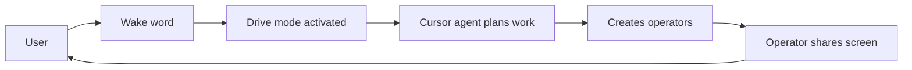

# Cursor Drive

**A voice-first, multi-operator pair-programming layer for Cursor IDE.** Steer operators via voice and chat; they share the Agent Screen (S-AS: **Share-AgentScreen** — operators share their screen with you). No cloud, no accounts.

[](https://github.com/drive-mode/cursor-drive/actions/workflows/ci.yml) [](https://opensource.org/licenses/MIT)

---

## The idea in one interaction



Drive mode transforms Cursor into a **senior engineer pair-programming partner**: it is concise, proactive, explains when helpful, and will challenge your choices once before deferring. You and your operators see the same screen—operators execute tasks, suggest improvements, and course-correct in real time alongside you.

---

## Installation

**Prerequisites:** Node 20+, npm, Cursor IDE.

```bash
git clone https://github.com/drive-mode/cursor-drive
cd cursor-drive
npm install
npm run compile
```

Press **F5** in Cursor to launch an Extension Development Host.

---

## Quick Start

1. Clone and install (see above).
2. Run `npm run compile`.
3. Press **F5** in Cursor to open the Extension Development Host.
4. Toggle Drive or use the first-run prompt.

See [getting started](docs/guides/getting-started.md) for the full dev loop.

---

## Architecture

Extension (`src/`), plugin layer (`.cursor/`), and MCP server — bridged at `:7891`.

```
┌─────────────────────────────────────────────────────────────────┐
│                        Cursor IDE                               │
│  ┌─────────────────────────────────────────────────────────┐    │
│  │  Extension (src/)     MCP :7891     .cursor/ Plugin      │    │
│  │  Pipeline, S-AS, TTS  ←→ Bridge ←→  skills, rules, hooks│    │
│  └─────────────────────────────────────────────────────────┘    │
└─────────────────────────────────────────────────────────────────┘
```

See [docs/architecture/README.md](docs/architecture/README.md) for the component map and ADRs.

---

## Key design decisions

| Principle | What it means |
|-----------|---------------|
| No cloud | TTS, filler cleaning, MCP run locally. ElevenLabs optional. |
| Config-first | Every behavior is a setting. Privacy-strict defaults. See [config schema](docs/reference/config-schema.md). |
| Cursor-native | Wraps Agent/Plan/Ask/Debug; `beforeSubmitPrompt` is primary entry. See [ADR-0008](docs/architecture/adr/ADR-0008-drive-mode-wrapper-architecture.md). |
| Concise-first | Summarizes, tells you where things went, waits. Configurable verbosity. |

---

## Multi-agent / Tangent flow

Spawn parallel operators, switch focus, merge context.

```
You:       "/tangent — explore the Clerk integration"
Drive:     spawns operator Beta, background
           Alpha continues (auth refactor)

You:       "/switch clerk"
Drive:     Beta foreground, Alpha background

You:       "/merge Beta into Alpha"
Drive:     Beta context merged into Alpha, Beta retired
```

See [prd-multi-agent](docs/prd/prd-multi-agent.md) for the full spec.

---

**Docs:** [docs/README.md](docs/README.md) | [getting started](docs/guides/getting-started.md) | [CONTRIBUTING.md](CONTRIBUTING.md) | [PRDs](docs/prd/README.md)

---

## Status

Core pipeline working: filler cleaner, router, model selector, status bar, TTS (say.js), operator registry, Share-AgentScreen (S-AS) webview, MCP server with tools. Prompt optimizer pending (tracked in `.cursor/plans/mvp-gaps.plan.md`). Several modules have unit tests.

---

## FAQ

**Do I need Cursor?** Yes. Drive is a Cursor IDE extension and uses Cursor's native modes (Agent/Plan/Ask/Debug) and hook system.

**How does voice work?** When Drive is active, prompts (voice or chat) go through the pipeline (filler cleaning, optional optimization, routing) before reaching the model. TTS runs locally via say.js; ElevenLabs is optional.

**What's the Agent Screen (S-AS)?** **Share-AgentScreen** (S-AS) is the idea of letting the operator share their screen with you. It's a webview where operators post activity, files touched, and decisions so you can see what each operator is doing.

---

## Support / Contributing

- **Contributing:** See [CONTRIBUTING.md](CONTRIBUTING.md) for branch strategy, PR workflow, and code quality.
- **Issues:** [GitHub Issues](https://github.com/drive-mode/cursor-drive/issues) for bugs and feature requests.
- **Docs:** [docs/README.md](docs/README.md) for the full doc index.

---

## License

MIT — see [LICENSE](LICENSE).
