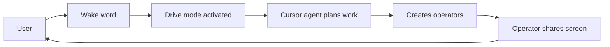

# Cursor Drive

A voice-first, multi-operator pair-programming layer for Cursor IDE. Steer operators via voice and chat; they share the Agent Screen. No cloud, no accounts.

[](https://github.com/drive-mode/cursor-drive/actions/workflows/ci.yml)

---

## The idea in one interaction

```
You (spoken):  "uhh maybe like refactor auth and also tangent — explore that
                new clerk integration in parallel"

Drive hears:   "Refactor auth module"
               + spawns Agent-2 on: "Research Clerk auth integration options"

Status bar:    Drive > Agent  [Agent-1: auth refactor]  [Agent-2: clerk research]

Agent-1 speaks: "Done — extracted AuthService, added tests. Summary in
                 docs/auth-refactor.md, want details?"

Agent-2 speaks: (different voice) "Found three integration paths. Sharing screen."
```

**Operator Flow in Drive Mode**



Drive mode transforms Cursor into a **senior engineer pair-programming partner**: concise, proactive, explains when helpful, challenges your choices once before deferring. You and your operators see the same screen in real time.

---

## Installation

**Prerequisites:** Node 20+, npm, Cursor IDE.

```bash
git clone https://github.com/drive-mode/cursor-drive
cd cursor-drive
npm install
npm run compile
```

Press **F5** in Cursor to launch an Extension Development Host.

**MCP one-click install:** [Install Drive MCP](cursor://anysphere.cursor-deeplink/mcp/install?name=drive&config=eyJkcml2ZSI6eyJ1cmwiOiJodHRwOi8vMTI3LjAuMC4xOjc4OTEvbWNwIn19) — click or paste into the browser. The extension must be running; if port 7891 is in use, the server uses 7892, 7893, etc. — check the Cursor Drive output channel.

**MCP Apps (Cursor 2.6+):** Enable `cursorDrive.mcp.enableApps` for inline Agent Screen UI. See [demo-mcp-apps](docs/guides/demo-mcp-apps.md).

---

## Quick Start

1. Clone and install (see above).
2. Run `npm run compile`.
3. Press **F5** in Cursor to open the Extension Development Host.
4. Toggle Drive or use the first-run prompt.

See [getting started](docs/guides/getting-started.md) for the full dev loop.

---

## Architecture

Extension (`src/`), plugin layer (`.cursor/`), and MCP server — bridged at `:7891`.

```
┌─────────────────────────────────────────────────────────────────┐
│                        Cursor IDE                               │
│  ┌─────────────────────────────────────────────────────────┐    │
│  │  Extension (src/)     MCP :7891     .cursor/ Plugin      │    │
│  │  Pipeline, S-AS, TTS  ←→ Bridge ←→  skills, rules, hooks│    │
│  └─────────────────────────────────────────────────────────┘    │
└─────────────────────────────────────────────────────────────────┘
```

**Extension vs Cursor Plugin:** The VS Code extension provides UI (status bar, Drive sidebar, Agent Screen). The Cursor Plugin (`.cursor-plugin/`) adds AI behavior (skills, rules). MCP Apps (Cursor 2.6+) enable inline UI in chat when `cursorDrive.mcp.enableApps` is on.

**UI surfaces:** Status bar (click → mode QuickPick), Drive sidebar (Activity Bar icon), Agent Screen (tab/panel). `Ctrl+Shift+D` toggles Drive. Composer (chat, send button, mic) is not extensible — extensions run in the extension host. See [drive-ui-surfaces-and-devtools](docs/design/ux/drive-ui-surfaces-and-devtools.md).

See [docs/architecture/README.md](docs/architecture/README.md) for the component map and ADRs.

---

## Key design decisions

| Principle | What it means |
|-----------|---------------|
| No cloud | TTS, filler cleaning, MCP run locally. ElevenLabs optional. |
| Config-first | Every behavior is a setting. Privacy-strict defaults. See [config schema](docs/reference/config-schema.md). |
| Cursor-native | Wraps Agent/Plan/Ask/Debug; `beforeSubmitPrompt` is primary entry. See [ADR-0008](docs/architecture/adr/ADR-0008-drive-mode-wrapper-architecture.md). |
| Concise-first | Summarizes, tells you where things went, waits. Configurable verbosity. |

---

## Source modules

| Component | Purpose |
|-----------|---------|
| `extension.ts` | Entry point, commands, MCP server |
| `driveMode.ts` | Drive state, `active` + `subMode` |
| `statusBar.ts` | Status bar, mode QuickPick |
| `router.ts` | Intent routing: plan/run/direct/collab |
| `modelSelector.ts` | 3-tier cost selection |
| `fillerCleaner.ts` | Client-side filler removal |
| `operatorRegistry.ts` | Operator pool: spawn, switch, merge |
| `agentScreen.ts` | Agent Screen (S-AS) webview |
| `tts.ts` | OS-native speech via say.js |
| `mcpServer.ts` | Local HTTP server on :7891 |

Full [component map](docs/architecture/README.md#component-map) in `docs/architecture/README.md`.

---

## Multi-agent / Tangent flow

Spawn parallel operators, switch focus, merge context.

```
You:       "/tangent — explore the Clerk integration"
Drive:     spawns operator Beta, background
           Alpha continues (auth refactor)

You:       "/switch clerk"
Drive:     Beta foreground, Alpha background

You:       "/merge Beta into Alpha"
Drive:     Beta context merged into Alpha, Beta retired
```

See [prd-multi-agent](docs/prd/prd-multi-agent.md) for the full spec.

---

## Documentation

| Topic | Where |
|-------|-------|
| Architecture, ADRs | [docs/architecture/](docs/architecture/README.md) |
| Guides, dev setup | [docs/guides/](docs/guides/README.md) |
| Config, MCP tools | [docs/reference/](docs/reference/README.md) |
| PRDs | [docs/prd/](docs/prd/README.md) |
| Design rationale | [docs/design/](docs/design/README.md) |
| Contributing | [CONTRIBUTING.md](CONTRIBUTING.md) |

---

## Status

Tests pass. Config schema added. Core pipeline working: filler cleaner, router, model selector, status bar, TTS (say.js), operator registry, Share-AgentScreen (S-AS) webview, MCP server with tools.

---

## Support / Contributing

- **Contributing:** See [CONTRIBUTING.md](CONTRIBUTING.md) for branch strategy, PR workflow, and code quality.
- **Issues:** [GitHub Issues](https://github.com/drive-mode/cursor-drive/issues) for bugs and feature requests.
- **Docs:** [docs/README.md](docs/README.md) for the full doc index.

---

## License

Proprietary — All Rights Reserved. See [LICENSE](LICENSE).
