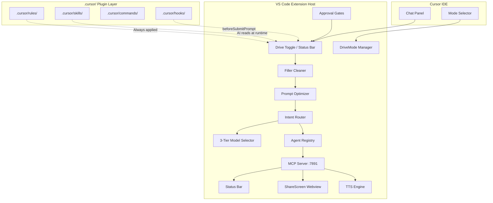
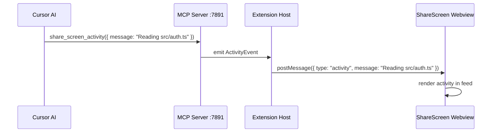
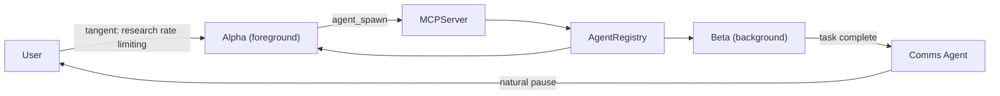

# Cursor Drive: Extension Design

## Summary

| Item | Value |
|------|-------|
| **Product** | **Cursor Drive** — standalone extension for Cursor IDE |
| **Mode** | **Drive mode** — voice-first AI driver; pair-programming teammate |
| **Goal** | Deeply integrated with Cursor ecosystem; uses all Cursor primitives |
| **Strategy** | Hybrid: VS Code extension (UI) + `.cursor/` plugin layer (AI) + local MCP server (bridge) |
| **ADR** | [ADR-0001](../../architecture/adr/ADR-0001-cursor-native-ingress-strategy.md) |

## Purpose

Build a **Cursor Drive** extension that adds **Drive mode** — a voice-first AI pair-programming driver. Uses all documented Cursor primitives: Agent, Chat, @codebase, @docs, @web, Rules, Commands, Skills, MCP tools, Codebase Indexing, and mode selection.

---

## 1. Architecture

Cursor Drive is a **standalone** system. Every module runs in the VS Code extension host or in the `.cursor/` plugin layer. There is no external backend, no shared core, no adapter layer.



---

## 2. The Request Pipeline

When Drive is active, the `beforeSubmitPrompt` hook routes prompts through this pipeline:

```
"drive agent uhh refactor auth maybe add tests idk"
  1. /cancel guard          → exits drive, returns early
  2. Activation word parse  → "drive" → setActive(true), "agent" → setSubMode("agent")
  3. Filler cleaner         → FREE, client-side → "Refactor auth, add tests"
  4. Prompt optimizer       → routing-tier model → "Refactor auth module: extract AuthService, add unit tests"
  5. Intent router          → driveSubMode="agent" → RouteMode="run"
  6. Model selector         → "run" → execution tier → request.model
  7. Main model call        → Drive persona + execution engineer system prompt
  8. stream.markdown()      → rendered response in chat
```

---

## 3. Cursor Primitives Integration

| Primitive | Use in Drive |
|-----------|--------------|
| **Agent** | Drive wraps Agent behavior; meta-layer over Cursor modes |
| **Drive mode toggle** | Status bar + Ctrl+Shift+D; beforeSubmitPrompt hook is the pipeline entry when active |
| **@codebase** | Semantic codebase understanding for context |
| **Rules** | Drive-specific rules in `.cursor/rules/` (always applied) |
| **Commands** | `/plan`, `/run`, `/switch`, `/agents`, `/tangent` |
| **Skills** | Drive persona, mode behaviors in `.cursor/skills/` |
| **MCP** | Local server at `:7891`; AI calls tools to update UI |
| **Codebase Indexing** | Semantic search for context gathering |
| **Keybindings** | `Ctrl+Shift+D` toggles Drive mode |

---

## 4. MCP Bridge Pattern

Local MCP server: Cursor AI calls MCP tools; extension handles them via VS Code APIs.



**MCP tools exposed:**

| Tool | What it does |
|------|-------------|
| `tts_speak` | Speak text aloud via OS TTS |
| `tts_stop` | Stop current speech |
| `share_screen_activity` | Add activity entry to ShareScreen feed |
| `share_screen_file` | Record a file touch in ShareScreen |
| `share_screen_decision` | Record a decision in ShareScreen |
| `drive_set_mode` | Update the active sub-mode (ask/plan/agent/debug) |
| `agent_spawn` | Spawn a new named agent context |
| `agent_switch` | Switch the foreground agent |
| `agent_list` | List all active agents |
| `agent_dismiss` | Remove an agent |
| `agent_merge` | Merge one agent's context into another |

---

## 5. UI Surfaces

### Status Bar
```
$(play-circle) Drive > Agent | Alpha    ← active, agent mode, foreground agent "Alpha"
$(circle-slash) Drive (off)             ← inactive
```
Click → QuickPick with mode options + agent options.

### ShareScreen Webview Panel
Opens beside the editor. Sections:
- **Activity feed**: real-time log of what the agent is doing
- **Files touched**: list of files read/written, click to open
- **Decisions**: key architectural decisions the agent made

### Extension commands (when Drive active)
Slash commands (via extension commands, not chat participant):
- `/plan`, `/agent`, `/ask`, `/debug` — force a sub-mode for this turn
- `/cancel` — exit Drive mode
- `/tangent [task]` — spawn a parallel agent
- `/switch [name]` — switch foreground agent
- `/agents` — open agent QuickPick

---

## 6. Multi-Agent System



The `AgentRegistry` manages a pool of named `AgentContext` instances. "Tangent" keyword spawning forks a background agent. The comms agent (routing tier) batches background updates and delivers them at natural pauses.

---

## 7. Open Questions

| ID | Question | Impact |
|----|----------|--------|
| OQ1 | Does Cursor expose a native Mode API for extensions? | Could register Drive as a first-class mode rather than a participant |
| OQ2 | Chat Participant API sticky UX? | May need enhanced Webview for room-like experience |

---

## References

- [ADR-0001: Cursor-Native Extension Strategy](../../architecture/adr/ADR-0001-cursor-native-ingress-strategy.md)
- [Drive Mode User Journey](../ux/drive-mode-user-journey.md)
- [Drive Mode Analysis & UX](../ux/drive-mode-analysis-and-ux.md)
- [Cursor Drive Plan](../../../.cursor/plans/cursor-drive.plan.md)
- [VS Code Chat Participant API](https://code.visualstudio.com/api/extension-guides/ai/chat)
- [VS Code Webview API](https://code.visualstudio.com/api/extension-guides/webview)
