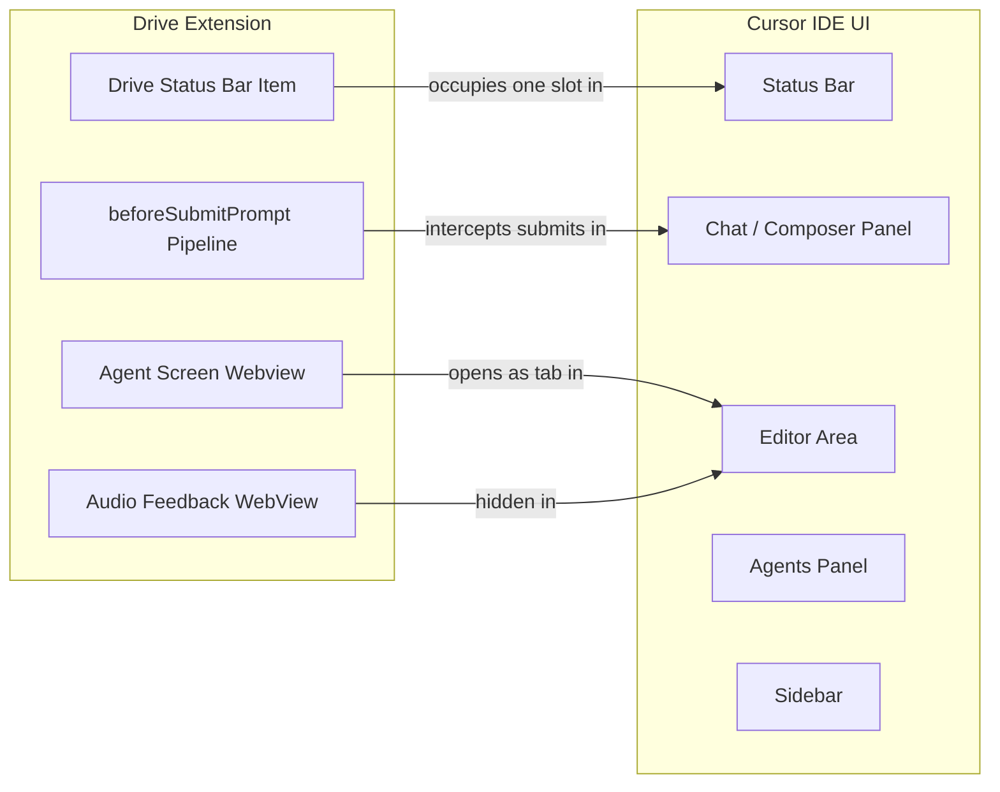
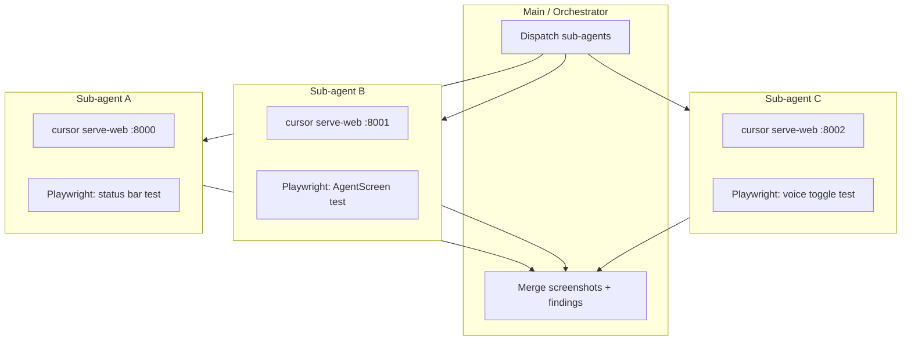

# Drive UI Layout Integration

How Cursor Drive fits into Cursor's native UI layout — surfaces, recommended configurations, and testing strategy.

---

## Drive's UI Surfaces

Drive **owns** three surfaces; it **interacts with** several more (Composer, QuickPicks, Output channels, native Agents panel, etc.). For the full list of 12 interaction points and the recommended DevTools workflow (Screencast, Inspect Context Keys, LogOutputChannel, click logger), see [drive-ui-surfaces-and-devtools.md](./drive-ui-surfaces-and-devtools.md). Summary of what Drive adds:

| Surface | Type | Location | Config |
|---|---|---|---|
| **Status bar item** | StatusBarItem | Left side, standard VS Code slot | Always visible when extension active |
| **Agent Screen (S-AS)** | WebviewPanel | Beside editor (tab or panel) | `cursorDrive.agentScreen.displayMode` |
| **Audio feedback** | Hidden WebView | Not visible | Plays chimes via Web Audio API |



---

## Status Bar Display

The status bar item appears in the left section with format:

- `$(circle-slash) Drive` — inactive
- `$(play-circle) Drive > Agent` — active, Agent sub-mode, no operators
- `$(play-circle) Drive > Agent | Alpha` — active, Agent sub-mode, Alpha is foreground operator
- `$(play-circle) Drive > Agent | Alpha (+2)` — 2 additional background operators

Click the status bar item → opens `cursorDrive.setSubMode` QuickPick.

---

## Agent Screen Display Modes

Set via `cursorDrive.agentScreen.displayMode`:

| Mode | Behavior | Best for |
|---|---|---|
| `tab` (default) | Opens as a tab beside the active editor | Single-monitor, standard Cursor layout |
| `panel` | Opens in the bottom panel area | Keeps editor area clean |
| `bottomLog` | Uses VS Code OutputChannel "Drive Agent Screen" | Minimal footprint, keyboard-only workflows |

### Opening automatically

Set `cursorDrive.agentScreen.autoOpen: true` to open Agent Screen whenever Drive activates. Useful for always-on voice-first sessions.

---

## Keybindings

| Keybinding | Action |
|---|---|
| `Ctrl+Shift+D` | Toggle Drive mode on/off |
| `Ctrl+Shift+S` | Show Agent Screen |
| `Ctrl+Shift+A` | Focus Agents view (opens native Agents panel + tries agent layout) |
| `Ctrl+Shift+M` | Activate voice input (open chat + mic) |

All keybindings are configurable via VS Code's Keyboard Shortcuts editor.

---

## Recommended Layouts

### Minimal voice-first layout

```
┌─────────────────────────────────────────────────────┐
│ Status bar: Drive > Agent | Alpha         [🎤] [...]  │
├──────────────────────┬──────────────────────────────┤
│                      │                              │
│  Editor              │  Chat / Composer             │
│                      │  (Cursor native)             │
│                      │                              │
├──────────────────────┴──────────────────────────────┤
│ Terminal (optional)                                  │
└─────────────────────────────────────────────────────┘
```

Settings:
- `cursorDrive.agentScreen.displayMode: "bottomLog"` (Agent Screen in output panel)
- `cursorDrive.voice.autoActivateMicOnToggle: true`
- Chat panel open on right side (`workbench.panel.chatSidebarLocation: "right"` or native Cursor default)

### Full monitoring layout (multi-monitor or large screen)

```
┌──────────────────────────────────────────────────────────────┐
│ Status bar: Drive > Agent | Alpha (+1)                        │
├──────────────────────┬──────────────────┬────────────────────┤
│                      │                  │                    │
│  Editor              │  Agent Screen    │  Chat / Composer   │
│                      │  Activity tab    │  (Cursor native)   │
│                      │  Files tab       │                    │
│                      │  Decisions tab   │                    │
├──────────────────────┴──────────────────┴────────────────────┤
│ Terminal                                                      │
└──────────────────────────────────────────────────────────────┘
```

Settings:
- `cursorDrive.agentScreen.displayMode: "tab"`
- `cursorDrive.agentScreen.autoOpen: true`
- Use `cursorDrive.focusAgentView` (Ctrl+Shift+A) to also dock Cursor's native Agents panel

### Minimal footprint (laptop)

```
┌─────────────────────────────────────────┐
│ Status bar: Drive > Agent               │
├─────────────────────────────────────────┤
│                                         │
│  Editor (full width)                    │
│                                         │
├─────────────────────────────────────────┤
│ OUTPUT: Drive Agent Screen (bottom log) │
└─────────────────────────────────────────┘
```

Settings:
- `cursorDrive.agentScreen.displayMode: "bottomLog"`
- `cursorDrive.syncNativeMode: true` (Drive mode syncs with Cursor's mode selector)

---

## How Drive Interacts With Cursor Layouts

### `cursor.tryAgentLayout`

Called when `cursorDrive.focusAgentView` runs. This native command attempts to apply Cursor's standard "agent" panel layout — typically docking the Agents panel to the right sidebar and expanding it. The exact effect varies by Cursor version.

### `composerMode.*` sync

When `cursorDrive.syncNativeMode: true` (default), switching Drive's sub-mode also calls the matching `composerMode.*` command, keeping Cursor's native mode selector in sync:

| Drive sub-mode | Native command called |
|---|---|
| plan | `composerMode.plan` |
| agent | `composerMode.agent` |
| ask | `composerMode.chat` |
| debug | `composerMode.debug` |

Users can turn this off if they prefer to manage Cursor's mode independently.

### Panel vs sidebar positioning

Drive respects whatever `workbench.panel.defaultLocation` and `workbench.sideBar.location` the user has set. Drive does not override panel positions.

---

## Testing Drive UI with Parallel Sub-Agents

### Architecture

Drive's browser dev workflow (from the `browser-dev-workflow` plan) enables Playwright-based UI testing:

```
compile → vsce package → cursor --install-extension → cursor serve-web :8000 → Playwright
```

To test Drive UI changes in parallel:



Each sub-agent:
1. Compiles the extension (or uses a pre-built VSIX)
2. Starts `cursor serve-web` on a unique port (8000, 8001, 8002...)
3. Runs its Playwright test suite
4. Takes screenshots for visual regression baseline
5. Returns results to the orchestrator

### Playwright test file: `tests/browser/drive-ui-integration.spec.ts`

See `tests/browser/drive-ui-integration.spec.ts` for the full test suite. Tests cover:

- Status bar presence in inactive state
- Drive mode toggle via command palette
- Agent Screen opening beside editor
- MCP server health check (optional, passes if MCP not running)

### MCP server coordination

When running `cursor serve-web`, the Drive MCP server at `:7891` must be started separately since it runs in the extension host (Node.js), not in the browser renderer. In the browser dev workflow:

1. `cursor serve-web` starts the browser UI
2. The extension host (with MCP server) starts automatically when the extension loads in serve-web
3. Verify MCP is up: `GET http://127.0.0.1:7891/health`

---

## Using `workbench.action.webview.openDeveloperTools` for UI Iteration

When developing AgentScreen UI changes (new CSS classes, new event types):

1. Run `cursorDrive.showAgentScreen` to open the webview
2. Run `cursorDrive.openWebviewDevTools` (command palette: "Drive: Open AgentScreen Developer Tools")
3. Chromium DevTools opens scoped to the Drive webview
4. Use Elements panel to prototype CSS changes live
5. Bake changes into `buildHtml()` in `src/agentScreen.ts`

This avoids the compile → reload cycle for CSS iteration. Only TypeScript logic changes require a recompile.

---

## Configuration Reference

| Setting | Type | Default | Description |
|---|---|---|---|
| `cursorDrive.agentScreen.displayMode` | `"tab" \| "panel" \| "bottomLog"` | `"tab"` | Where Agent Screen appears |
| `cursorDrive.agentScreen.autoOpen` | boolean | `false` | Open Agent Screen on Drive activation |
| `cursorDrive.agentScreen.clickBehavior` | `"openInEditor" \| "openInNewWindow"` | `"openInEditor"` | File click behavior in Agent Screen |
| `cursorDrive.agentScreen.showPlanProgress` | boolean | `true` | Show plan progress bar in Agent Screen |
| `cursorDrive.syncNativeMode` | boolean | `true` | Sync Drive sub-mode to Cursor's composerMode |
| `cursorDrive.voice.autoActivateMicOnToggle` | boolean | `false` | Auto-start mic when Drive activates |
