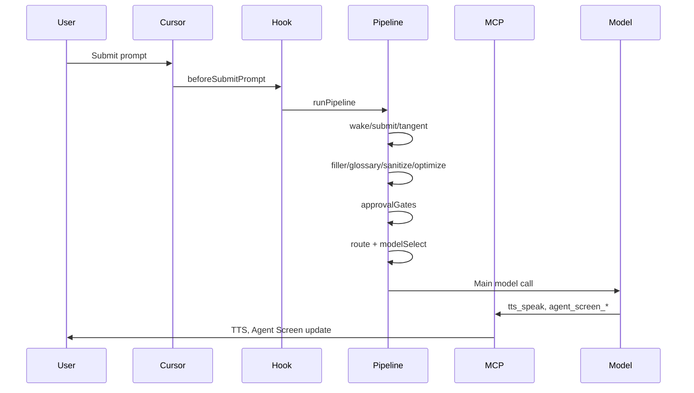
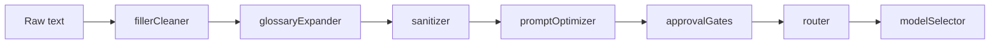
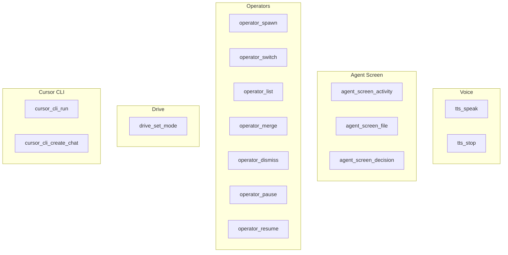

# Implemented Features — Data Flow

Simplified data-flow view of Cursor Drive. Complements [features-implemented-flow.md](features-implemented-flow.md).

---

## Request Flow (Simplified)

---

## Voice Pipeline Stages

---

## MCP Tools Implemented

