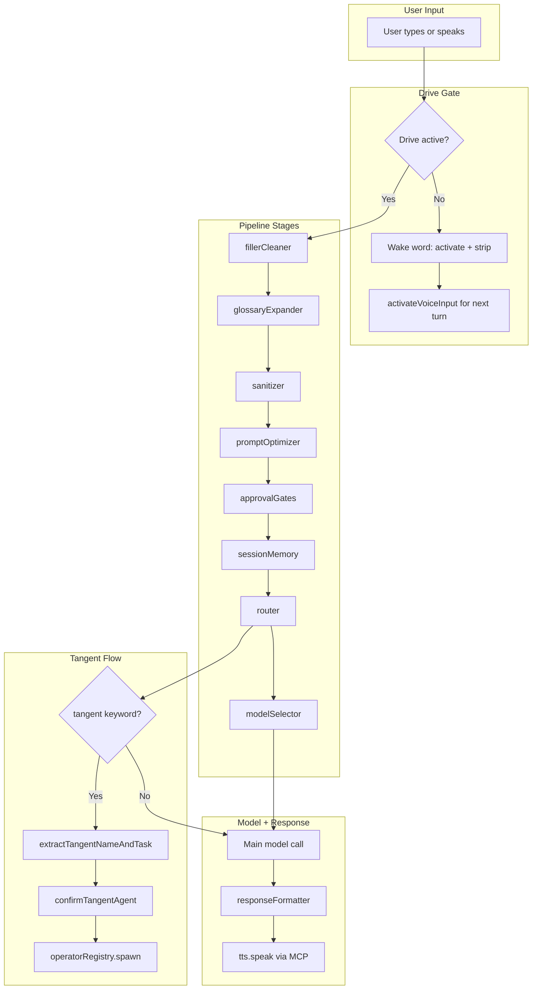
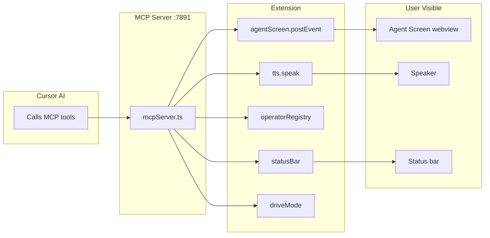
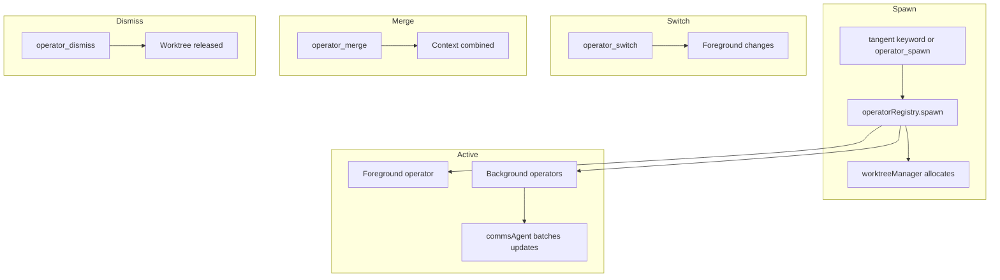

# Implemented Features Flow

Mermaid diagrams of implemented Cursor Drive features. Renders in any Markdown viewer that supports Mermaid (GitHub, VS Code, etc.).

---

## 1. Main Pipeline Flow



---

## 2. MCP Bridge: AI to Extension



---

## 3. Operator Lifecycle



---

## 4. UI Surfaces

```mermaid
flowchart TB
    subgraph Surfaces [Drive UI Surfaces]
        U1[Status Bar: Drive > Mode | Operator]
        U2[Agent Screen: Activity | Files | Decisions | Sync]
        U3[Drive Sidebar: Activity Bar panel]
        U4[QuickPick: mode switch, operator switcher]
    end

    subgraph Sources [Data Sources]
        D1[mcpServer agent_screen_*]
        D2[operatorRegistry]
        D3[driveMode]
    end

    D1 --> U2
    D2 --> U1
    D2 --> U4
    D3 --> U1
    D3 --> U4
```

---

## 5. Module to ADR/PRD Map

| Module | ADRs | PRDs |
|--------|------|------|
| pipeline.ts | 0005, 0009, 0012 | 1, 2 |
| fillerCleaner, glossaryExpander, sanitizer | 0012 | 1 |
| promptOptimizer | 0012 | 1 |
| tts, voiceCommands | 0012 | 1 |
| mcpServer | 0003, 0004, 0016, 0022 | 3, 5 |
| operatorRegistry, commsAgent | 0004, 0016, 0020, 0021 | 3 |
| agentScreen, agentScreenApp | 0003, 0016, 0017 | 5 |
| approvalGates, toolAllowlist | 0005, 0020 | 4 |
| sessionMemory, persistentMemory | 0015, 0005 | 2 |
| worktreeManager, syncLedger, integrationQueue | 0022 | 3 |
| driveMode, statusBar, driveSidebar | 0002, 0008, 0013 | 5 |
