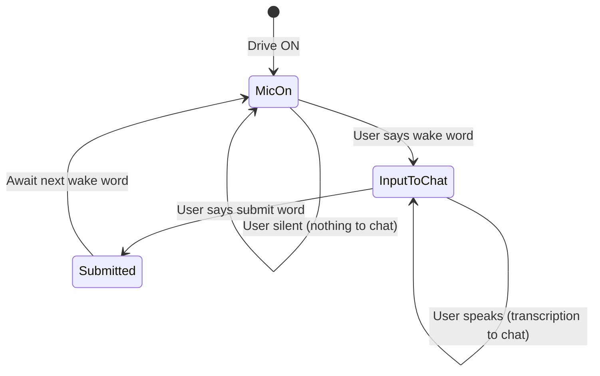

# Voice Model: Mic On vs Wake-Word-Gated Composer Input

## Conceptual distinction

Drive mode uses two distinct states for granular, hands-free verbal control:

| State | Purpose | User control |
|-------|---------|--------------|
| **Mic on** | Audio capture is active; system is listening | Drive ON → mic on by default. User can mute/unmute. |
| **Wake word** | Gate that routes the mic's input into the chatbox via the composer action | User says wake phrase → transcription flows into chat input |

**Why this matters:** The user can have the mic on (listening) but not yet "accepting" input into the chat. Saying the wake word opens the gate: now the composer action puts the mic's transcription into the chat input. This allows:

- Mic on, user says nothing → nothing goes to chat
- User says wake word → agent confirms verbally ("Drive listening")
- User speaks request → transcription goes to chat
- User says submit word → prompt is sent

## Desired flow

## Current Cursor constraint

Cursor's built-in STT and composer do **not** separate "listening" from "dictating to chat". When `composer.toggleVoiceDictation` (or `workbench.action.chat.startVoiceChat`) runs, the mic turns on **and** transcription goes directly to the chat input. There is no API for "listen but don't transcribe to chat until wake word".

| Desired | Current Cursor API |
|---------|--------------------|
| Mic on, no input to chat until wake word | Not available; mic on = transcription to chat |
| Wake word opens gate | We detect wake word only in **submitted** text (post-submission) |
| Composer action triggered by wake word | We call `activateVoiceInput` after wake word detection to turn mic on for the **next** turn |

## What we implement today

1. **Drive ON** → `activateVoiceInput()` runs (if `autoActivateMicOnToggle`). Mic on, transcription to chat.
2. **Wake word in submitted text** → We activate Drive (if off), strip the phrase, speak "Drive listening", and call `activateVoiceInput()` so the mic is on for the next utterance.
3. **Submit word** → We strip it and bypass the prompt optimizer.

The wake word does **not** gate input in real time; we only see it after the user submits. So we approximate the model: when we detect the wake word, we ensure the mic is on for the follow-up turn.

## Future path for true gating

To implement the full model (mic on, no input to chat until wake word):

1. **WebView SpeechRecognition** — Capture audio in a webview; buffer transcript; do not send to composer until wake word is detected in the stream.
2. **Composer injection** — After wake word, send accumulated text to the chat via `composer.startComposerPrompt2` or equivalent.
3. **Privacy** — ADR-0005: no raw audio retention; transcript buffering must be ephemeral and user-controlled.

See [voice-user-journey-storyboard.md](voice-user-journey-storyboard.md) F9/F10 for the documented gap and recommended path.

## References

- ADR-0012 — Mic is mute/unmute; wake word is optional
- PRD 1 (Voice I/O) — Wake word detection, submit word
- [drive-tab-vision-and-voice-flow.md](drive-tab-vision-and-voice-flow.md) — Target flow, waveform notes
