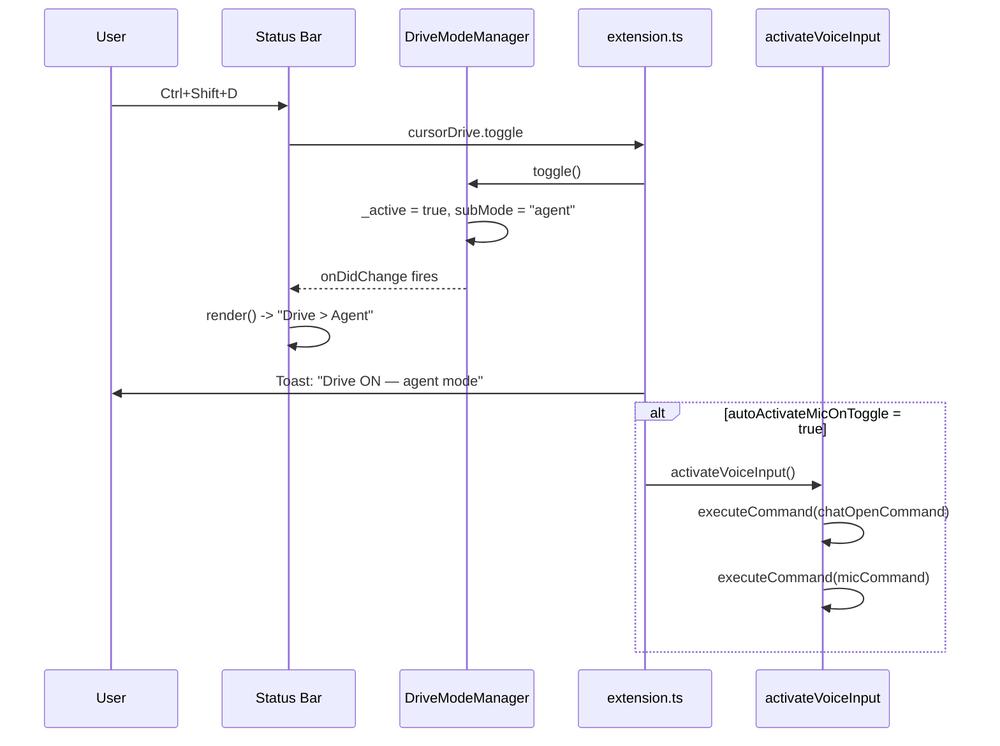
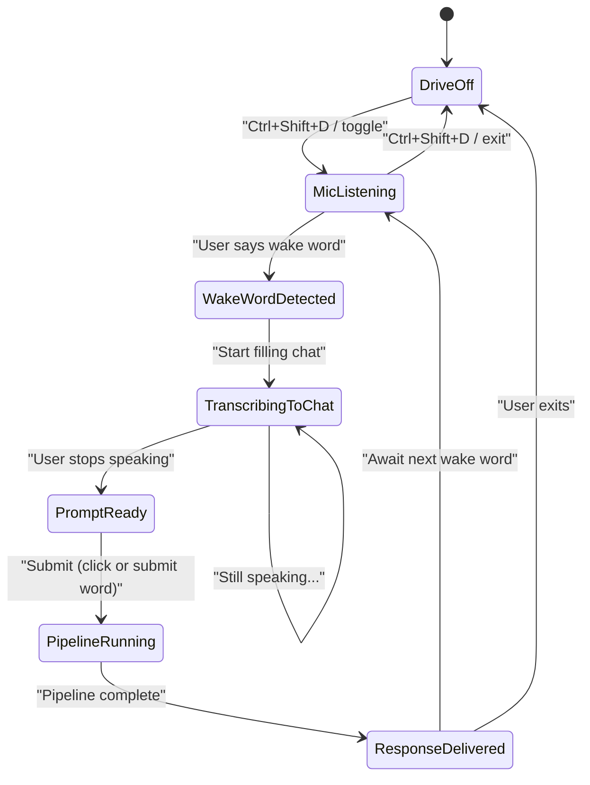
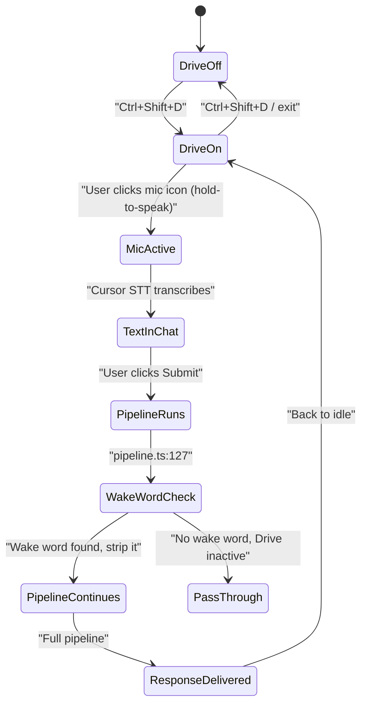
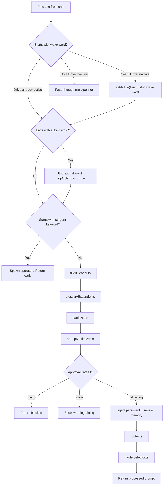
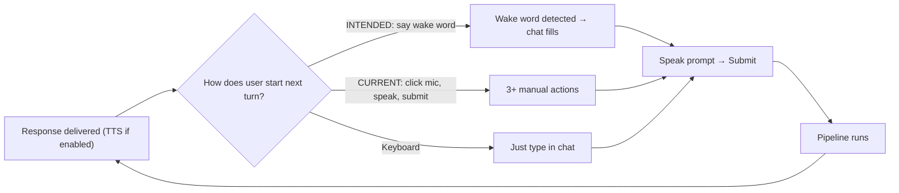

# Cursor Drive: Voice User Journey Storyboard

> Design doc for the voice-first interaction loop. Covers install → configure → use → repeat cycles,
> identifies friction points (F1–F25) and failure modes (X1–X13), and includes a prioritized friction
> severity matrix. Companion to [drive-mode-user-journey.md](drive-mode-user-journey.md).

---

## Phase 1 — Install and First Run

**Steps:**

- User installs VSIX via `Extensions: Install from VSIX` or marketplace
- Extension activates: `src/extension.ts` `activate()` creates DriveModeManager, OperatorRegistry,
  SessionMemory, CommsAgent, MCP server, status bar
- Status bar appears: `$(circle-slash) Drive (off)`
- No first-run wizard or onboarding notification exists

**Friction points:**

- **F1**: No first-run guide. User sees a cryptic "Drive (off)" in the status bar with no context.
  The [user journey doc](drive-mode-user-journey.md) mentions a first-run guide but none is implemented.
- **F2**: MCP server requires manual `.cursor/mcp.json` registration. Without it, Cursor agents cannot
  call Drive tools. *(Partially resolved: deep-link auto-registration added in drive-ux-polish plan.)*
- **F3**: Plugin install (`cursorDrive.installPluginToWorkspace`) is a separate manual step. Skills,
  commands, hooks, and rules don't load until this runs.

**Failure modes:**

- **X1**: MCP server port 7891 already in use — `DriveMcpServer.start()` fails with a warning toast.
  User may not notice.
- **X2**: Python not in PATH — hooks (`drive-preprocessor.py`, `plan-runner.py`) fail silently. No
  diagnostic surfaces this.
- **X3**: Extension activation can fail if `createDriveModeManager()` throws — user gets output channel
  error, extension is dead.

---

## Phase 2 — Configuration

**Steps:**

- User opens Settings, searches "cursorDrive"
- Key settings to configure for voice-first use:
  - `cursorDrive.wakeWord` (default: `"hey drive"`)
  - `cursorDrive.submitWord` (default: `"send it"`)
  - `cursorDrive.tts.enabled` (default: `false`)
  - `cursorDrive.defaultSubMode` (default: `"agent"`)
  - `cursorDrive.voice.autoActivateMicOnToggle` (default: `false`)
  - `cursorDrive.promptOptimizer.enabled` / `.autoApprove`

**Friction points:**

- **F4**: 28+ config keys with no guided setup. No "recommended voice preset" to apply in one step.
- **F5**: `cursorDrive.voice.micCommand` previously defaulted to `"workbench.action.chat.voice.start"`
  which may not exist in Cursor. *(Resolved: updated default to `workbench.action.chat.startVoiceChat`.)*
- **F6**: TTS is off by default (privacy-correct per ADR-0005), but the "pair-programming call"
  experience requires multiple settings changes to enable.

---

## Phase 3 — Activation (Keyboard Path)

**Steps:**

- User presses `Ctrl+Shift+D`
- `cursorDrive.toggle` fires in `src/extension.ts`
- `DriveModeManager.toggle()` sets `_active = true`, applies `defaultSubMode` from config
- Status bar re-renders: `Drive > Agent`
- If `voice.autoActivateMicOnToggle` is true: opens chat panel + fires mic command

**Friction points:**

- **F7**: `autoActivateMicOnToggle` defaults to false. First-time voice users must enable this or
  manually open chat and click the mic button.
- **F8**: Keybinding `Ctrl+Shift+D` conflicts with VS Code's "Debug: Start Debugging" in some
  configurations.

**Failure modes:**

- **X4**: `workbench.action.chat.open` may not exist if Cursor changes its chat architecture.
  Fails silently (by design, but user gets no mic).
- **X5**: Mic command silent failure means mic never starts, with no user-visible error.

---

## Phase 4 — Voice Input Loop

This is the core interaction loop. The diagram below contrasts **intended** vs **current** behaviour.

### Intended flow

### Current (actual) flow

### Gap analysis

| Capability | Intended | Current | Code location |
| --- | --- | --- | --- |
| Continuous mic listening | Always-on while Drive active | Cursor's hold-to-speak only | No impl |
| Real-time wake word detection | In live audio stream | In submitted text (`pipeline.ts:127`) | `runPipeline()` |
| Gated transcription to chat | Wake word opens the gate | All transcription goes to chat immediately | No impl |
| Pre-wake-word buffer | Optional setting to retain | N/A (no continuous capture) | No impl |
| Post-submit return to listening | Automatic, awaits next wake word | User must manually click mic again | `activateVoiceInput()` only on toggle |

**What would be needed to close the gap:**

- A WebView running Web Speech API (`SpeechRecognition`) for continuous audio capture
- A local wake word detector (keyword spotting on interim transcription results)
- Programmatic injection of transcribed text into Cursor's chat input (no known API)
- OR: Drive's own input WebView replaces Cursor's chat input when in voice mode

**WebView SpeechRecognition feasibility (F9/F10 gap analysis):**

`SpeechRecognition` is available in Chromium-based WebViews. A Drive AgentScreen webview could run
continuous recognition and detect the wake word. However:

1. The webview must have `enableScripts: true` (already set) and microphone permission — Electron
   grants microphone to WebViews when the host app has it, but this is not guaranteed across Cursor
   versions.
2. Injecting the recognized text into Cursor's chat input has no stable API. `composer.startComposerPrompt2`
   accepts a prompt string and could be called from the extension host; this is the most viable bridge.
3. Alternatively, `workbench.action.chat.open` + clipboard write + paste simulation could work but is
   fragile.

**Recommended path:** Implement `SpeechRecognition` in the AgentScreen WebView as an opt-in beta
(`cursorDrive.voice.continuousMode: false` by default). On wake word detection, call
`vscode.commands.executeCommand("composer.startComposerPrompt2", transcript)`. Validate in Phase 1
of the voice gap closure work.

**Friction points:**

- **F9**: VS Code/Cursor has no extension API for continuous audio capture. WebView `SpeechRecognition`
  is the only viable path.
- **F10**: No known stable API to programmatically write text into Cursor's chat input field.
  `composer.startComposerPrompt2` is a candidate but undocumented.
- **F11**: No visual indicator when wake word is recognised. User doesn't know the gate opened.
- **F12**: After submit, mic state resets (Cursor's mic is per-utterance).

**Friction points in the current text-based flow:**

- **F13**: User must hold mic, speak (including "hey drive" prefix), release, then submit — three manual
  actions per turn.
- **F14**: Wake word is only checked at prompt start (`text.toLowerCase().startsWith(wakeWord)`). Mid-sentence
  use is ignored.
- **F15**: Prompt optimizer QuickPick modal breaks hands-free flow. `autoApprove` must be true for
  smooth voice use.
- **F16**: After response, user must manually click the mic button again.

---

## Phase 5 — Pipeline Processing (per submission)

**Failure modes:**

- **X6**: `selectCheapModel()` returns null — prompt optimizer silently skips.
- **X7**: Approval gate blocks a legitimate prompt — warning toast may confuse the user.
- **X8**: Glossary expander has no default entries — does nothing until configured.
- **X9**: Filler cleaner may over-aggressively remove semantically meaningful words like "like".
- **X10**: If `autoApprove` is false and Drive is in voice mode, the QuickPick popup breaks flow.

---

## Phase 6 — Multi-Agent Interaction

**Steps:**

- User says "tangent research Clerk integration"
- Pipeline detects tangent keyword, spawns operator Beta in background
- Status bar: `Drive > Agent | Alpha (+1)` (if Alpha exists)
- CommsAgent queues updates from background operators
- After idle timeout (30 s), CommsAgent flushes: summarizes via cheap model, delivers to Agent
  Screen + TTS + toast
- User says `/switch Beta` or uses operator QuickPick
- User says `/merge Beta into Alpha`

**Friction points:**

- **F17**: First tangent spawns the first operator. Before this, no operators exist, so "Alpha"
  appears from nowhere.
- **F18**: `/switch` and `/merge` slash commands require `installPluginToWorkspace` to have been run.
- **F19**: CommsAgent's 30 s idle timer may fire during a long voice utterance.

**Failure modes:**

- **X11**: "tangent" as a natural word ("on a tangent, I was thinking...") false-positive spawns an
  operator.
- **X12**: Operator name pool exhausts after 8 names (Alpha → Theta).
- **X13**: `CommsAgent.summarize()` calls `selectCheapModel()` which may fail, delivering raw
  unsummarized messages.

---

## Phase 7 — Repeat Cycle

**Friction points:**

- **F20**: Each turn in current flow requires: click mic, hold and speak, release, click submit — four
  actions.
- **F21**: No mechanism to auto-return to "listening for wake word" state after a response.
- **F22**: TTS response may overlap with when the user wants to speak next. `interruptOnInput` only
  triggers on typing, not on mic activation.
- **F23**: No conversational history awareness between voice turns (session memory helps but is
  prompt-injected, not truly conversational).

---

## Phase 8 — Deactivation

**Steps:**

- User presses `Ctrl+Shift+D` again, clicks status bar → "Off", or runs `cursorDrive.exit`
- `DriveModeManager.setActive(false)`, status bar renders "Drive (off)"
- TTS stops via `ttsStop()`
- MCP server remains running (by design, for inter-session continuity)

**Friction points:**

- **F24**: No voice command to deactivate Drive. Must use keyboard or mouse.
- **F25**: Operators remain in registry after Drive deactivates. Stale operators may surface on
  re-activation.

---

## Friction Severity Matrix

| ID | Description | Severity | Fix complexity |
| --- | --- | --- | --- |
| F1 | No first-run onboarding | Medium | Low — welcome notification with "Configure Drive" action |
| F2 | MCP auto-registration | High | ✅ Resolved in drive-ux-polish plan (deep link) |
| F5 | Mic command default wrong | High | ✅ Resolved — updated to `startVoiceChat` |
| F9 | No continuous audio capture API | Critical | High — WebView SpeechRecognition (see gap analysis above) |
| F10 | Cannot write to Cursor's chat input | Critical | High — `composer.startComposerPrompt2` candidate |
| F13 | 4 manual actions per voice turn | High | Depends on F9/F10 resolution |
| F15 | QuickPick breaks voice flow | Medium | Low — default `autoApprove: true` when TTS enabled |
| F17 | "Alpha" appears from nowhere | Low | Low — auto-spawn default operator on activation |
| F20 | No auto-return to listening | High | Medium — post-response mic re-trigger |
| F24 | No voice exit command | Medium | Low — add "drive off" to pipeline wake word detector |

---

## Critical Failure Points Between Modules

| Failure | From | To | Current mitigation |
| --- | --- | --- | --- |
| X1: Port conflict | extension.ts | mcpServer.ts | Warning toast only |
| X4: Chat command missing | extension.ts | VS Code API | Silent catch |
| X5: Mic command missing | extension.ts | Cursor API | ✅ Updated default + silent catch |
| X6: No cheap model | promptOptimizer.ts | modelSelector.ts | Skip optimization |
| X9: Over-aggressive filler clean | fillerCleaner.ts | pipeline.ts | None |
| X11: False tangent detection | pipeline.ts | operatorRegistry.ts | None |

---

## Prioritized Next Actions

Based on the severity matrix, the highest-leverage fixes in order:

1. **F9/F10 spike** — Prototype WebView `SpeechRecognition` + `composer.startComposerPrompt2`
   injection in a dev branch. Validates the entire continuous-voice path before building.
2. **F1** — Add a first-run welcome notification pointing to key voice settings. One-day effort.
3. **F15** — Auto-enable `promptOptimizer.autoApprove` when `tts.enabled` is true. One-hour fix.
4. **F20** — After `runPipeline` success, re-trigger `activateVoiceInput()` if Drive is still
   active and `voice.autoActivateMicOnToggle` is true. One-hour fix.
5. **F24** — Detect "drive off" / "stop drive" in pipeline wake word handler. One-hour fix.
