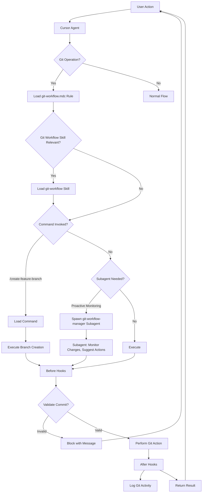

# Git Workflow Architecture

Primitive orchestration for git workflow management. Shows how Rule, Command, Skill, Subagent, and Hooks work together.

## Diagram

## Primitive roles

| Primitive | Role | When |
|-----------|------|------|
| **Rule** | What (standards) | Git context active |
| **Command** | How (manual procedure) | `/create-feature-branch` invoked |
| **Skill** | When (orchestration) | Git workflow request detected |
| **Subagent** | Who (proactive specialist) | Monitoring, suggestions |
| **Hooks** | Enforcement | Before commits, validation |

## References

- Plan: `.cursor/plans/cursor-primitives-complete-bootstrap.plan.md`
- Rule: `.cursor/rules/git-workflow.mdc`
- Skill: `.cursor/skills/git-workflow/SKILL.md`
- Data flow: `git-workflow-data-flow.diagram.md`
