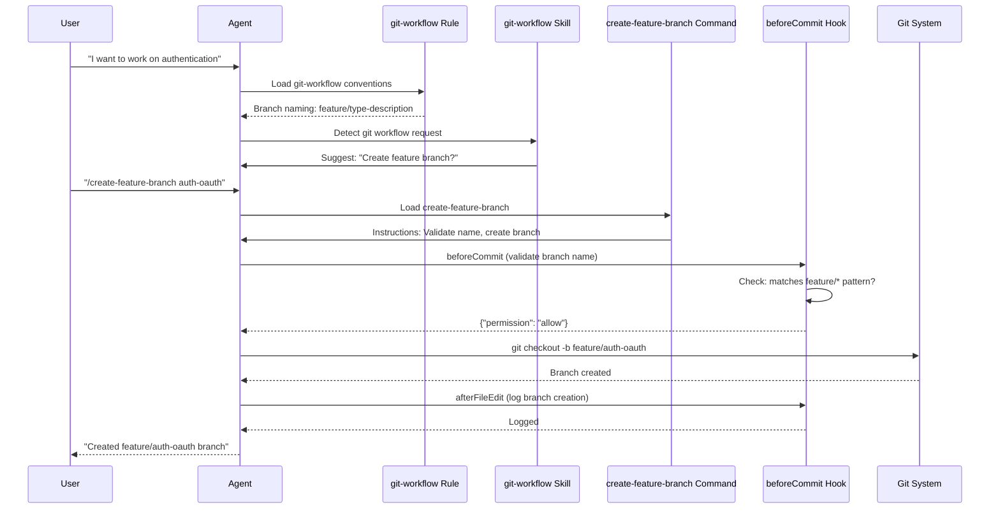

# Git Workflow Data Flow: Feature Branch Creation

Sequence diagram for the feature branch creation use case. Shows interaction between User, Agent, Rule, Skill, Command, Hook, and Git.

## Diagram

## Steps

1. User expresses intent → Agent loads Rule for conventions
2. Skill detects git workflow → suggests branch creation
3. User invokes Command → Agent loads Command instructions
4. Hook validates branch name before git execution
5. Git creates branch
6. Hook logs activity
7. Agent confirms to user

## References

- Architecture: `git-workflow-architecture.diagram.md`
- Plan: `.cursor/plans/cursor-primitives-complete-bootstrap.plan.md`
