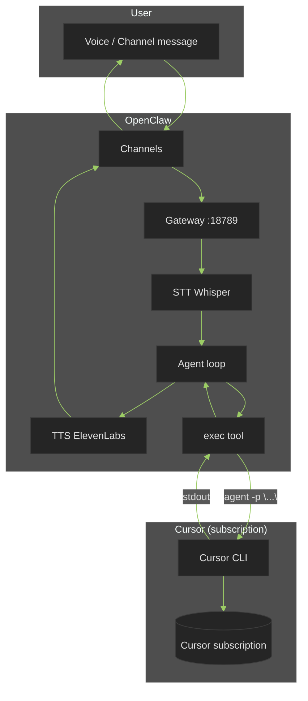
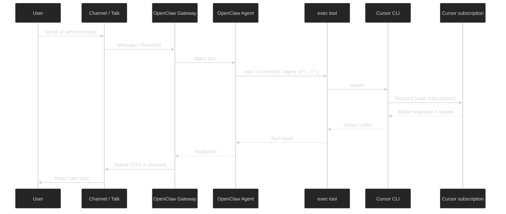

# OpenClaw Feature Review and Cursor-Native Integration

Detailed review of OpenClaw's features, integration surfaces, and how to use it with **Cursor as the LLM** (Cursor subscription) via the **Cursor CLI**. OpenClaw handles voice/channels; Cursor handles coding.

See [openclaw-integration-analysis.md](openclaw-integration-analysis.md) for license, compatibility, and high-level "literally using" summary.

---

## 1. OpenClaw Feature Inventory

| Area | Features | Notes |
|------|----------|--------|
| **Gateway** | Single daemon, default `ws://127.0.0.1:18789`, HTTP + WebSocket on same port | One Gateway per host; owns all channel sessions (WhatsApp, Telegram, etc.). |
| **Channels** | WhatsApp (Baileys), Telegram (grammY), Slack, Discord, Signal, iMessage, WebChat, MS Teams, Mattermost, IRC, LINE, Matrix, Feishu, Twitch, Nostr, Zalo, Nextcloud Talk, Synology Chat, Tlon, BlueBubbles (iMessage), Broadcast groups | Inbound/outbound messaging; pairing and allowlists per channel. |
| **Voice** | **Voice Wake** (wake word, e.g. "Hey OpenClaw"; push-to-talk via right Option on macOS), **Talk Mode** (continuous listen → STT → agent → TTS), **STT** (OpenAI Whisper), **TTS** (ElevenLabs default, or OpenAI/Edge) | Voice Wake + Talk Mode in macOS/iOS/Android apps; config in `~/.openclaw/openclaw.json` (`voice`, `talk`). |
| **Agent runtime** | Pi-style agent loop; receives messages, calls tools, streams replies; supports **thinking** levels, **model override** per request | Uses OpenClaw-configured model providers (OpenAI, Anthropic, OpenRouter, Ollama, etc.). **No built-in Cursor provider.** |
| **Model providers** | OpenAI, Anthropic, OpenRouter, Google (Gemini/Vertex), OpenCode Zen, Ollama, vLLM, Mistral, xAI, Cerebras, Groq, Hugging Face, Kilo Gateway, GitHub Copilot, Moonshot (Kimi), Qwen, Volcano/BytePlus, Synthetic, MiniMax, Z.AI, custom `models.providers` (OpenAI-compatible URLs) | Model refs: `provider/model` (e.g. `anthropic/claude-opus-4-6`). Keys via env or onboarding. |
| **Tools** | **exec** (shell commands; foreground/background, host: sandbox/gateway/node, approvals, allowlist/safeBins), **apply_patch** (experimental), browser, agent-send, slash commands, reactions, sub-agents, LLM task, Lobster workflows, plugins | **exec** can run arbitrary commands on gateway (or node); ideal for invoking Cursor CLI. |
| **Skills** | `~/.openclaw/workspace/skills/<name>/SKILL.md` with YAML frontmatter + Markdown; permissions; optional scripts; tools.catalog | Skills instruct the agent when to use which tools; can tell agent "for coding, use exec to run Cursor CLI." |
| **Webhooks** | `POST /hooks/wake` (heartbeat/system event), `POST /hooks/agent` (message, model, channel, deliver, timeout, sessionKey, agentId); token auth (header); hooks.mappings for custom endpoints | Inbound only: external systems trigger OpenClaw. No built-in "call out to Cursor" — we use exec or a bridge. |
| **WebSocket protocol** | First frame: `connect` (role: operator/node, scopes, device identity, challenge/signature). Then: req/res (e.g. `agent`, `send`, `health`), server-push events (`agent`, `presence`, `tick`). Idempotency for side effects. | Operators: CLI, web UI, automations. Nodes: capability hosts (camera, screen, voice, etc.). |
| **Plugins** | TypeScript modules; register tools, commands, Gateway RPC; run in-process with Gateway | For custom tools (e.g. "run Cursor" as a first-class tool) without shell exec. |
| **Nodes** | macOS/iOS/Android/headless; declare caps (camera, screen, canvas, location, voice), commands; pairing; device token | Voice/camera/screen come from nodes; Gateway orchestrates. |
| **A2UI / Canvas** | `/__openclaw__/a2ui/`, `/__openclaw__/canvas/` on same port as Gateway | Web UI and agent-editable canvas. |
| **Session** | Sessions keyed by sessionKey; main session; compaction; hooks.defaultSessionKey for webhook runs | Agent runs from webhooks use isolated session key (e.g. `hook:ingress`). |

OpenClaw does **not** ship a Cursor model provider. To use your **Cursor subscription** as the LLM, the agent's "coding" step must be delegated to Cursor. The practical way is to run the **Cursor CLI** (`agent -p "..."`) from inside OpenClaw (exec tool or custom plugin).

---

## 2. Integration Options (What "Literally Integrating" Means)

Three main ways to integrate OpenClaw with our stack:

| Option | Direction | Use case |
|--------|-----------|----------|
| **Webhooks (inbound)** | External system → OpenClaw | Trigger wake or run an agent turn with a message (e.g. from Drive, cron, GitHub). OpenClaw runs *its* agent with *its* models unless we use exec to call Cursor. |
| **WebSocket client** | Our app ↔ Gateway | Extension or bridge connects as **operator**; send `req:agent` with message, receive streamed reply. Same as above: OpenClaw's agent runs unless we use exec. |
| **Exec tool (inside OpenClaw)** | OpenClaw agent → shell | Agent uses `exec` to run `agent -p "user request"` (Cursor CLI). OpenClaw's model can be minimal (orchestrator); Cursor does the coding. **This is how we use Cursor natively.** |

So: **Cursor CLI is the bridge.** OpenClaw handles voice, channels, and UX; when the user asks for coding help, OpenClaw's agent (or a dedicated skill) runs the Cursor CLI with the user's prompt and returns the CLI output as the reply. No Cursor API key in OpenClaw; Cursor subscription is used only by the CLI on the same machine.

---

## 3. Using OpenClaw with Cursor Natively (Cursor CLI as Backend)

**Goal:** LLM access via Cursor subscription; OpenClaw for voice, channels, and conversation surface.

**Assumptions:**

- Cursor CLI installed and authenticated (`cursor.com/install`, `agent` or `cursor agent` in PATH).
- OpenClaw Gateway running (e.g. `openclaw onboard --install-daemon`), with an agent that can use the **exec** tool.
- Exec allowed on **gateway** (or node) with an allowlist that includes the Cursor CLI binary (or a wrapper script).

**Flow:**

1. User speaks or sends a message (Telegram, WhatsApp, OpenClaw Talk Mode, etc.).
2. OpenClaw transcribes (if voice) and hands the message to its agent.
3. Agent (optionally guided by a **Drive/Cursor skill**) calls the **exec** tool with something like: `agent -p "<escaped user message>"` (or `cursor agent -p "..."` depending on install). Use `host: gateway` and a long `timeout` (e.g. 300–600s) for coding tasks.
4. Cursor CLI runs using the **Cursor subscription** on that machine; it can read/write files, run commands (with approval), and use Cursor's models.
5. CLI stdout (and optionally stderr) is returned to the exec tool; the OpenClaw agent uses that as the reply text.
6. OpenClaw sends the reply to the user (TTS, channel, or WebChat).

**Skill design (Drive-as-OpenClaw-skill):**

- Put a skill under `~/.openclaw/workspace/skills/cursor-drive/` (or similar) with a `SKILL.md` that:
  - Tells the agent that for **coding, development, or code review** requests it must use the **exec** tool.
  - Specifies the exact command: e.g. `agent -p "<user message>"` with proper escaping (no direct shell injection).
  - Prefer a **wrapper script** (e.g. `cursor-drive-run.sh`) that takes one argument (the prompt), passes it to `agent -p "..."`, and returns exit code + stdout so the agent can format the reply or report failures.

**Exec configuration (Gateway):**

- Allow exec on the gateway: `tools.exec.host: "gateway"` (or per-session via `/exec host=gateway`).
- Add the Cursor CLI binary (or wrapper) to the exec **allowlist** so the agent can run it without approval every time (or use approval for safety).
- Set `tools.exec.timeout` (or per-call `timeout`) to allow long-running coding tasks (e.g. 600 seconds).

**Cursor CLI quirks:**

- No stdin prompt: use `-p "prompt"` (or `agent "prompt"` for interactive with initial prompt). For non-interactive automation, `agent -p "..."` is the right surface.
- `--output-format text` helps for machine-readable replies.
- CLI can hang after responding in some modes; use a timeout and possibly `--print` if you need streaming; document behavior for your OpenClaw skill.

**Summary:** Using OpenClaw with Cursor natively means: **OpenClaw = voice + channels + conversation; Cursor CLI = coding backend via exec.** No Cursor API key in OpenClaw; subscription is used only by the CLI.

---

## 4. Alternative: Drive HTTP API + OpenClaw Webhook (Inbound to Drive)

If we add a small **Drive HTTP API** (e.g. `POST /run` with `{"prompt":"..."}`) that runs Cursor CLI internally and returns the result:

- OpenClaw does **not** call this by default (webhooks are for *triggering* OpenClaw).
- An **external orchestrator** (e.g. cron, GitHub Action, or a small daemon that subscribes to OpenClaw events) could: get the user message (e.g. from a channel bridge or OpenClaw's session API over WebSocket), POST to Drive's `/run`, get the response and then send it back into OpenClaw (e.g. via `POST /hooks/agent` with a synthesized assistant message, or via WebSocket `send`).

That's more moving parts. The **simpler path** is: OpenClaw agent + exec tool + Cursor CLI (no Drive HTTP API required for basic integration).

---

## 5. Architecture Diagrams (Dark-Mode Mermaid)

Diagrams use a dark theme (dark background, light text) for readability in dark-mode docs.

### High-level: OpenClaw + Cursor CLI (native subscription)



### Sequence: Voice → OpenClaw → Cursor CLI → Reply



### Integration options (all three)

```mermaid
%%{init: {'theme':'dark', 'themeVariables': { 'primaryColor':'#2d5016','primaryTextColor':'#e0e0e0','lineColor':'#9ccc65','background':'#1a1a1a','mainBkg':'#252525','textColor':'#e0e0e0'}}}%%
flowchart LR
    subgraph External["External systems"]
        WH[Webhook caller]
        WS[WebSocket client]
    end
    subgraph OpenClaw["OpenClaw Gateway"]
        Hooks["/hooks/wake\n/hooks/agent"]
        GW_WS[WebSocket API]
        Agent[Agent + exec]
    end
    subgraph Cursor["Cursor"]
        CLI[Cursor CLI]
    end
    WH -->|POST + token| Hooks
    WS <-->|connect, req:agent| GW_WS
    Hooks --> Agent
    GW_WS --> Agent
    Agent -->|exec: agent -p "..."| CLI
```

### Cursor Drive + OpenClaw (future: Drive HTTP API)

```mermaid
%%{init: {'theme':'dark', 'themeVariables': { 'primaryColor':'#2d5016','primaryTextColor':'#e0e0e0','lineColor':'#9ccc65','background':'#1a1a1a','mainBkg':'#252525','textColor':'#e0e0e0'}}}%%
flowchart TB
    subgraph Channels["Channels / Voice"]
        TG[Telegram]
        WA[WhatsApp]
        Voice[Talk Mode]
    end
    subgraph OpenClaw["OpenClaw"]
        GW[Gateway]
        Agent[Agent]
    end
    subgraph Bridge["Bridge (optional)"]
        Daemon[Daemon / Cron]
    end
    subgraph Drive["Cursor Drive"]
        API[HTTP API /run]
        MCP[MCP :7891]
        Ext[Extension]
    end
    subgraph Cursor["Cursor"]
        CLI[Cursor CLI]
        IDE[Cursor IDE]
    end
    TG & WA & Voice --> GW
    GW --> Agent
    Agent -->|exec: agent -p "..."| CLI
    Daemon -.->|"POST /run"| API
    API -.-> CLI
    Ext <--> MCP
    IDE <--> MCP
```

---

## 6. Summary Table: What You Need to Literally Use OpenClaw with Cursor

| Item | Responsibility |
|------|----------------|
| **OpenClaw Gateway** | Run daemon; voice, channels, agent loop, exec tool. |
| **Cursor CLI** | Installed, authenticated; used as coding backend via exec. |
| **OpenClaw config** | Exec allowlist for `agent` (or wrapper); exec on gateway; timeout for long runs. |
| **Skill (optional)** | `~/.openclaw/workspace/skills/cursor-drive/SKILL.md` instructs agent to use exec with Cursor CLI for coding. |
| **Drive extension** | Unchanged; can run alongside. Optional: future HTTP API or WebSocket client to OpenClaw for richer flows. |

**Does this make the extension unusable with Cursor?** No. OpenClaw runs beside Cursor. Cursor remains the IDE and the source of LLM access via the CLI; the extension continues to work in Cursor as today.
